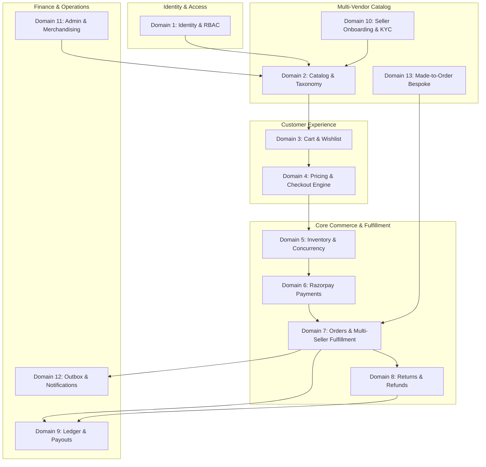

# OGURA P0 — CONTRACT + ARCHITECTURE FREEZE REPORT
**Phase:** P0 (Context, Architecture & Contract Audit)  
**Status:** **BLOCKED** (Pending 3 Commercial/Product Decisions)  
**Date:** 2026-09-15  
**Workspace:** `.` (repository root)  
**Target Backend:** Lovable Cloud / PostgreSQL / PostgREST / Supabase Auth & Storage / Deno Edge Functions / Razorpay & Razorpay Route  
**Target Scale:** 100,000 Users | 10,000 SKUs | ~100,000 Inventory Units | Multi-Vendor Marketplace  

---

# TABLE OF CONTENTS
1. [Executive Status & Verdict](#1-executive-status--verdict)
2. [Authoritative Sources Reviewed & Precedence Hierarchy](#2-authoritative-sources-reviewed--precedence-hierarchy)
3. [Target Backend Architecture Summary](#3-target-backend-architecture-summary)
4. [Domain Map & Marketplace Boundaries](#4-domain-map--marketplace-boundaries)
5. [Authoritative 35-Table Database Contract](#5-authoritative-35-table-database-contract)
6. [Comprehensive State Machine Audit (11 State Machines)](#6-comprehensive-state-machine-audit-11-state-machines)
7. [Security & Trust Boundary Contract](#7-security--trust-boundary-contract)
8. [Financial Model & Double-Entry Ledger Contract](#8-financial-model--double-entry-ledger-contract)
9. [Inventory & Concurrency Control Contract](#9-inventory--concurrency-control-contract)
10. [External Provider Matrix](#10-external-provider-matrix)
11. [Frontend / Backend Integration Boundary (BE-001 to BE-036)](#11-frontend--backend-integration-boundary-be-001-to-be-036)
12. [Production Scale & Performance Review](#12-production-scale--performance-review)
13. [Critical Contract Audit: 12 Known Risk Areas](#13-critical-contract-audit-12-known-risk-areas)
14. [Missing Decisions & Commercial Register](#14-missing-decisions--commercial-register)
15. [P1 Prerequisites Checklist](#15-p1-prerequisites-checklist)
16. [Exact Blockers Summary](#16-exact-blockers-summary)
17. [Explicit Declaration of P1 Readiness](#17-explicit-declaration-of-p1-readiness)

---

## 1. Executive Status & Verdict

### Final P0 Status: **BLOCKED**

This comprehensive P0 audit reconciles all authoritative product specifications, forensic code extractions, and architectural engineering flows for the OGURA luxury fashion marketplace.

The frontend prototype has been hardened and technically verified (`FRONTEND INTEGRITY: PASS`), compiling cleanly under Nitro SSR and React 19 with zero TypeScript errors. The architectural trust boundaries, 35-table database model, 11 core state machines, double-entry financial ledger, and Edge Function registry have been fully designed.

However, in accordance with the Zero-Tolerance Execution Protocol, **P1 implementation cannot begin** until **3 critical commercial and business policy decisions** are explicitly resolved by the founder/human architect:
1. **Shipping Tariff Policy (`CONF-01`):** A three-way contradiction exists across active frontend code (`cart.tsx` charges ₹149 below ₹2,999; `checkout.tsx` charges ₹99 standard / ₹249 express; `mock/index.ts` charges flat ₹99; `shipping.tsx` is silent). Furthermore, multi-vendor shipping fee allocation (per-seller vs flat platform) remains undefined.
2. **GST Invoice & Platform Commission Accounting Policy (`CONF-04`):** B2C catalog prices are displayed tax-inclusive, but the statutory breakdown of 18% GST on platform commissions, reverse charge mechanisms, and HSN-level invoice generation must be canonically locked for the financial ledger schema.
3. **Made-to-Order (MTO) Intake Destination (`CONF-02`):** Active product pages and merchandising banners link to a nonexistent route (`/made-to-order/request`, throwing 404). The product destination (custom intake form vs modal vs concierge WhatsApp redirect) must be determined to avoid breaking the Hard UI/UX Freeze.

**Zero lines of application source code were modified during P0.**

---

## 2. Authoritative Sources Reviewed & Precedence Hierarchy

The following documentation and codebase artifacts were forensically inspected and reconciled:

| Source Document | Path / Location | Authority Level | Role in Audit |
|---|---|---|---|
| **Explicit Founder / Product Answers** | Project Records / Instructions | **Rank 1 (Highest)** | Resolves business and commercial policies |
| **OGURA Master PRD** | `DOCS/context.md` | **Rank 2** | Defines core marketplace behavior, actors, and functional scopes |
| **OGURA Backend Engineering Flows** | `DOCS/context.md` (Sections 10–25) | **Rank 3** | Specifies transaction pipelines, state machines, and edge rules |
| **OGURA Production Runbook** | `DOCS/context.md` (Sections 27–31) | **Rank 4** | Sets P0→P19 phased delivery milestones and verification gates |
| **Frontend Extraction Baseline** | `DOCS/frontend.md` | **Rank 5** | Catalog of 47 routes, 23 repository methods, and 36 BE operations |
| **Master Forensic & Issue Report** | `DOCS/report.md` | **Rank 6** | Register of frontend fixes (FIX-A/B/C) and known technical debt |
| **Active Frontend Implementation** | `src/routes/`, `src/state/`, `src/data/` | **Rank 7** | Working UI/UX, styling tokens, and mock data to be preserved |
| **Prototype Scaffold Plan** | `.lovable/plan/...-2026-09-08.md` | **Rank 8 (Lowest)** | Historical mock reference; subordinate to production flows |

### Precedence Invariant:
```
Founder Answers > Master PRD > Backend Flows > Execution Runbook > Frontend Code > Mock Repositories > Engineering Assumptions
```
Under no circumstances may engineering invent a business rule to bypass an unresolved product contradiction.

---

## 3. Target Backend Architecture Summary

The production architecture replaces in-memory mock repositories and browser `localStorage` with a multi-tenant, cloud-native transactional backend built on Lovable Cloud and PostgreSQL:

```text
┌─────────────────────────────────────────────────────────────────────────┐
│                      CLIENT TIER (LOCKED FRONTEND)                      │
│       TanStack Start (Nitro SSR) + React 19 + Tailwind CSS v4           │
│      47 Routes | 311 Product Styles | 1,463 SKUs | Client Repositories   │
└────────────────────────────────────┬────────────────────────────────────┘
                                     │
                 HTTPS / REST / PostgREST / JSON RPC
                                     │
┌────────────────────────────────────▼────────────────────────────────────┐
│                    API & TRUST BOUNDARY LAYER                           │
│                                                                         │
│  [RLS-Scoped Direct Reads]             [Edge Functions / RPC Engine]    │
│  - Public Catalog Browsing             - auth-send-otp / verify         │
│  - Faceted Filter Queries              - checkout-quote-calculator      │
│  - User Wishlist & Profile             - payment-create-order           │
│  - Seller Sub-Order Scopes             - payment-webhook-handler        │
│                                        - seller-fulfillment-dispatch    │
│                                        - refund-approval-trigger        │
│                                        - payout-route-transfer          │
└────────────────────────────────────┬────────────────────────────────────┘
                                     │
┌────────────────────────────────────▼────────────────────────────────────┐
│                      CANONICAL DATA STORE                               │
│                PostgreSQL 16 (Lovable Cloud)                            │
│  - 35 Relational Tables with Foreign Key Integrity                      │
│  - Row-Level Security (RLS) enforcing Tenant & Role Isolation           │
│  - ACID Transactions for Checkout, Inventory & Financial Ledger         │
│  - Server Clock (`CURRENT_TIMESTAMP`) as Authoritative Time              │
│  - Integer Paise Currency Math (`BIGINT` / `CHECK amount >= 0`)         │
└────────────────────────────────────┬────────────────────────────────────┘
                                     │
           ┌─────────────────────────┴─────────────────────────┐
           │                                                   │
┌──────────▼───────────────┐                       ┌───────────▼───────────────┐
│   TRANSACTIONAL OUTBOX   │                       │    SCHEDULED CRON JOBS    │
│  - Notification Events   │                       │  - Inventory TTL Release  │
│  - Carrier Webhooks      │                       │  - Return Window Closure  │
│  - Audit Trail Pipeline  │                       │  - Payout Reconciliation  │
└──────────┬───────────────┘                       └───────────────────────────┘
           │
┌──────────▼──────────────────────────────────────────────────────────────┐
│                     EXTERNAL PROVIDER INTEGRATIONS                      │
│  - Razorpay (Customer Checkout Payment via UPI/Cards/Netbanking)        │
│  - Razorpay Route (Marketplace Seller Split & Scheduled Settlements)     │
│  - Logistics Partner (Shiprocket / Delhivery AWB & Tracking Sync)       │
│  - Communications (Resend Email, Gupshup / Twilio WhatsApp & SMS)       │
│  - Cloud Storage (Lovable Cloud / Supabase Storage with CDN Caching)    │
└─────────────────────────────────────────────────────────────────────────┘
```

### Core Architecture Rules:
1. **Zero Client Authority:** The client is purely a presentation layer. It never dictates prices, inventory availability, discounts, shipping fees, tax rates, payment status, order numbers, or user roles.
2. **PostgreSQL as Single Source of Truth:** External providers (Razorpay, couriers, SMS gateways) are integration endpoints, not sources of truth. All operational and financial state resides canonically in PostgreSQL.
3. **Double-Entry Append-Only Ledger:** Every rupee moved in the marketplace is recorded in an immutable ledger with matching credit and debit entries.
4. **Isolated Operational Roles:** Catalog admins cannot issue payouts; support agents cannot issue financial refunds without Finance approval; sellers cannot view other sellers' products or orders.

---

## 4. Domain Map & Marketplace Boundaries

The marketplace backend is partitioned into 13 discrete functional domains:



1. **Domain 1: Identity & Access Management (IAM):** Phone OTP, email auth, Google OAuth, session cookies, customer profiles, address book, and RBAC (`customer`, `seller`, `admin_super`, `admin_catalog`, `admin_finance`, `admin_support`, `admin_viewer`).
2. **Domain 2: Multi-Vendor Catalog & Taxonomy:** Categories, subcategories, occasions, brands, designers, master products (styles), variants (SKUs), and media assets. Universal Visibility Gate ensures only live products from active sellers appear.
3. **Domain 3: Customer Commerce State:** Persistent server bag/cart lines, guest cart session tracking, guest-to-authenticated merge, and customer wishlist.
4. **Domain 4: Pricing, Shipping & Checkout Engine:** Server-authoritative quote generator calculating subtotal, promo discounts, shipping fees, tax lines, and payable amounts in integer paise with a 15-minute validity window.
5. **Domain 5: Inventory & Concurrency Engine:** Stock-on-hand tracking per variant/size, atomic reservations (`SELECT FOR UPDATE`), 15-minute TTL holds, automated release workers, and post-payment stock decrement.
6. **Domain 6: Razorpay Payment & Webhook Processing:** Creation of cryptographic Razorpay orders, client SDK checkout integration, HMAC SHA256 webhook signature verification, replay protection, and payment state transitions.
7. **Domain 7: Orders & Multi-Vendor Fulfillment:** Parent order orchestration, seller sub-order decomposition, line item tracking, AWB generation, carrier dispatch, and shipment milestone synchronization.
8. **Domain 8: Returns, Cancellations & Customer Refunds:** 7-day post-delivery return intake, support moderation, reverse logistics pickup, hub QC condition checks, Finance refund authorization, and Razorpay refund execution.
9. **Domain 9: Financial Ledger & Seller Payouts:** Double-entry append-only accounting ledger, commission deductions, GST accounting, statutory 1% TCS / 1% TDS (Section 194-O) withholding, return-window holding, and Razorpay Route settlement.
10. **Domain 10: Seller Onboarding & KYC Compliance:** Seller business registration, GSTIN/PAN document verification, bank account penny-drop validation, and Finance approval gating payouts.
11. **Domain 11: Administration, Merchandising & Moderation:** Global catalog moderation, merchandising banner/insert slot scheduling, product review approval, and immutable administrative audit logs.
12. **Domain 12: Notification & Outbox Dispatch:** Transactional outbox pattern for asynchronous email receipts (Resend) and WhatsApp/SMS alerts (Gupshup/Twilio) with guaranteed delivery and retry backoff.
13. **Domain 13: Made-to-Order (MTO) Bespoke Workflow:** Custom design intake, bespoke measurement capture, atelier review, price quoting, customer approval, and custom crafting lifecycle.

---

## 5. Authoritative 35-Table Database Contract

The production schema requires **35 relational tables** in PostgreSQL to satisfy all PRD operational, multi-vendor isolation, and compliance requirements (reconciling the 23 frontend-visible entities with the backend infrastructure):

| # | Table Name | Primary Key | Major Foreign Keys | Ownership Boundary | Important State / Status Fields | Financial / Inventory Role | RLS Policy Requirement |
|---|---|---|---|---|---|---|---|
| **1** | `profiles` | `id (UUID)` | `auth.users(id)` | Customer / User | `role`, `is_active` | None | User reads/updates own; Admin reads all. |
| **2** | `user_roles` | `id (UUID)` | `user_id → profiles(id)` | System / Super Admin | `role (enum)` | None | System/Super Admin only. Public read blocked. |
| **3** | `customer_addresses` | `id (UUID)` | `user_id → profiles(id)` | Customer | `is_default`, `is_active` | Shipping destination | User CRUD own addresses. |
| **4** | `admin_audit_logs` | `id (BIGSERIAL)` | `admin_id → profiles(id)` | System / Super Admin | `action`, `entity_type` | Audit trail | Append-only. Super Admin read-only. |
| **5** | `sellers` | `id (UUID)` | `user_id → profiles(id)` | Seller / Admin | `status (onboarding/active/suspended)` | Commission rate (%) | Seller reads own; Admin reads/updates all. |
| **6** | `seller_kyc_documents` | `id (UUID)` | `seller_id → sellers(id)` | Seller / Finance Admin | `verification_status (pending/verified/rejected)` | KYC gate for payouts | Seller uploads own; Finance Admin reviews. |
| **7** | `seller_bank_accounts` | `id (UUID)` | `seller_id → sellers(id)` | Seller / Finance Admin | `penny_drop_status`, `is_verified` | Route settlement account | Seller reads own; Finance Admin verifies. |
| **8** | `brands` | `id (UUID)` | `seller_id → sellers(id)` | Seller / Catalog Admin | `is_active`, `is_featured` | Brand presentation skin | Public reads active; Seller edits own. |
| **9** | `designers` | `id (UUID)` | `brand_id → brands(id)` | Seller / Catalog Admin | `is_active` | Designer presentation skin | Public reads active; Catalog Admin edits. |
| **10** | `categories` | `id (UUID)` | None | Catalog Admin | `is_active`, `sort_order` | Category department | Public read active; Catalog Admin edits. |
| **11** | `subcategories` | `id (UUID)` | `category_id → categories(id)` | Catalog Admin | `is_active`, `sort_order` | Subcategory taxonomy | Public read active; Catalog Admin edits. |
| **12** | `occasions` | `id (UUID)` | None | Catalog Admin | `is_active`, `sort_order` | Curated merchandising | Public read active; Catalog Admin edits. |
| **13** | `products` | `id (UUID)` | `brand_id → brands`, `seller_id → sellers`, `subcategory_id` | Seller / Catalog Admin | `status (draft/submitted/live/suspended)` | Master style & base price | Public reads `live`; Seller edits own drafts. |
| **14** | `product_variants` | `id (UUID)` | `product_id → products(id)` | Seller / Catalog Admin | `is_active` | SKU, size, color, MRP, listing price | Public reads active; Seller manages own. |
| **15** | `media_assets` | `id (UUID)` | `product_id → products(id)` | Seller / Catalog Admin | `slot_role (primary/secondary/detail)` | Cloud CDN media URLs | Public read; Seller uploads to own product. |
| **16** | `inventory_items` | `id (UUID)` | `variant_id → product_variants(id)` | Seller / System | `quantity_on_hand`, `quantity_reserved` | Authoritative stock ledger | Seller reads own; System atomically updates. |
| **17** | `inventory_reservations` | `id (UUID)` | `variant_id → product_variants`, `quote_id → checkout_quotes` | System | `status (held/committed/released)` | Holds stock during checkout | System service-role only. |
| **18** | `inventory_audit_log` | `id (BIGSERIAL)` | `variant_id → product_variants` | System | `change_type (reservation/sale/return/restock)` | Immutable stock history | Append-only. Admin reads; System writes. |
| **19** | `carts` | `id (UUID)` | `user_id → profiles(id)` | Customer / Guest | `status (active/converted/abandoned)` | Active shopping bag | User owns cart; Session matches guest. |
| **20** | `cart_lines` | `id (UUID)` | `cart_id → carts`, `variant_id → product_variants` | Customer / Guest | `quantity` | Bag line items | Scoped strictly to parent cart ownership. |
| **21** | `customer_wishlist` | `id (UUID)` | `user_id → profiles`, `product_id → products` | Customer | `created_at` | Customer saved styles | User owns wishlist rows; unique `(user, prod)`. |
| **22** | `checkout_quotes` | `id (UUID)` | `user_id → profiles(id)` | Customer / System | `status (pending/paid/expired)` | Authoritative price quote in paise | User reads own quote; System writes. |
| **23** | `orders` | `id (UUID)` | `user_id → profiles`, `quote_id → checkout_quotes` | Customer / Admin | `order_number`, `status (placed/confirmed/...)` | Master order financial total | User reads own; Admin reads all; System writes. |
| **24** | `seller_sub_orders` | `id (UUID)` | `order_id → orders`, `seller_id → sellers` | Seller / Admin | `sub_order_number`, `status` | Seller order slice & payout | Seller reads own; Admin reads all. |
| **25** | `order_items` | `id (UUID)` | `sub_order_id → seller_sub_orders`, `variant_id` | Seller / Customer | `price_paise`, `seller_payout_paise` | Item price, tax, seller cut | Buyer & assigned Seller read item lines. |
| **26** | `order_status_history` | `id (BIGSERIAL)` | `order_id → orders`, `actor_id → profiles` | System | `from_status`, `to_status`, `notes` | State transition audit | Append-only audit trail. |
| **27** | `shipments` | `id (UUID)` | `sub_order_id → seller_sub_orders`, `seller_id` | Seller / System | `carrier`, `awb_number`, `status` | Logistics tracking milestone | Seller/Buyer read own; System/Courier updates. |
| **28** | `payment_transactions` | `id (UUID)` | `order_id → orders(id)` | System / Finance Admin | `gateway_order_id`, `gateway_payment_id`, `status` | Real money transaction record | System service-role only; Finance Admin read. |
| **29** | `webhook_events` | `id (BIGSERIAL)` | None | System | `provider (razorpay/courier)`, `processed` | Raw provider payload log | Append-only. System service-role only. |
| **30** | `return_requests` | `id (UUID)` | `order_item_id → order_items`, `user_id` | Customer / Support | `reason`, `status (requested/approved/rejected/...)` | Return authorization | Buyer reads own; Support Admin reviews. |
| **31** | `refund_transactions` | `id (UUID)` | `return_id → return_requests`, `order_id` | Finance Admin / System | `gateway_refund_id`, `status`, `amount_paise` | Money refund transaction | Finance Admin authorizes; System executes. |
| **32** | `mto_requests` | `id (UUID)` | `product_id → products`, `user_id → profiles` | Customer / Seller | `status (submitted/review/quoted/accepted/...)` | Bespoke order value quote | Buyer & assigned Seller access request. |
| **33** | `financial_ledger_entries` | `id (BIGSERIAL)` | `order_id`, `sub_order_id`, `seller_id` | System / Finance Admin | `entry_type (CR/DR)`, `account_type` | Double-entry money ledger | Append-only. Zero direct update/delete. |
| **34** | `payout_statements` | `id (UUID)` | `seller_id → sellers(id)` | Seller / Finance Admin | `settlement_period`, `net_amount_paise`, `status` | Seller bank payout record | Seller reads own; Finance Admin approves. |
| **35** | `notification_outbox` | `id (BIGSERIAL)` | `order_id`, `recipient_user_id` | System | `channel (email/sms/whatsapp)`, `status`, `attempts` | Transactional message queue | Append-only queue processed by background cron. |

---

## 6. Comprehensive State Machine Audit (11 State Machines)

Every critical entity in OGURA is governed by an explicit finite state machine with defined transition authorities, triggers, and idempotency guarantees:

### 1. Seller Lifecycle State Machine
- **States:** `APPLICATION` → `UNDER_REVIEW` → `APPROVED (ONBOARDING)` → `ACTIVE` → `SUSPENDED` → `TERMINATED`
- **Transitions:**
  - `APPLICATION → UNDER_REVIEW`: Auto-triggered upon profile submission.
  - `UNDER_REVIEW → APPROVED`: Platform Super Admin action.
  - `APPROVED → ACTIVE`: Triggered when at least 1 product is approved and bank account is linked.
  - `ACTIVE ↔ SUSPENDED`: Platform Admin action (suspension immediately triggers Universal Visibility Gate to hide all seller products).
- **Invalid Transitions:** `APPLICATION → ACTIVE` (Bypassing admin review is prohibited).
- **Idempotency:** Unique `seller_id` state lock.

### 2. Product Lifecycle State Machine
- **States:** `DRAFT` → `SUBMITTED` → `IN_REVIEW` → `LIVE` → `REJECTED` → `SUSPENDED` → `ARCHIVED`
- **Transitions:**
  - `DRAFT → SUBMITTED`: Seller action.
  - `SUBMITTED → IN_REVIEW`: Catalog Admin action.
  - `IN_REVIEW → LIVE`: Catalog Admin approval (or trusted seller auto-publish rule).
  - `IN_REVIEW → REJECTED`: Catalog Admin rejection (requires rejection reason).
  - `LIVE ↔ SUSPENDED`: Catalog Admin action or automated seller suspension cascade.
- **Universal Visibility Gate:** Product renders on storefront ONLY if `product.status = 'LIVE'` AND `seller.status = 'ACTIVE'` AND `stock > 0`.

### 3. Seller KYC & Verification State Machine
- **States:** `NOT_SUBMITTED` → `DOCUMENTS_UPLOADED` → `PENNY_DROP_PENDING` → `PENNY_DROP_VERIFIED` → `FINANCE_APPROVED (KYC_VERIFIED)` → `REJECTED`
- **Transitions:**
  - `NOT_SUBMITTED → DOCUMENTS_UPLOADED`: Seller uploads GSTIN, PAN, Bank Statement.
  - `DOCUMENTS_UPLOADED → PENNY_DROP_PENDING`: Razorpay Route account creation triggered.
  - `PENNY_DROP_PENDING → PENNY_DROP_VERIFIED`: Automated bank penny drop returns matching name.
  - `PENNY_DROP_VERIFIED → KYC_VERIFIED`: Finance Admin sign-off.
- **Rule:** KYC does NOT prevent selling or order placement, but **strictly gates payouts**. Funds remain in `ACCRUED_HOLD` until `KYC_VERIFIED`.

### 4. Inventory Concurrency & Reservation State Machine
- **States:** `AVAILABLE` → `HELD_IN_CHECKOUT` → `COMMITTED (SOLD)` → `RELEASED (BACK_TO_AVAILABLE)`
- **Transitions:**
  - `AVAILABLE → HELD_IN_CHECKOUT`: Triggered when customer completes checkout Step 3 (Address) and initiates Step 4 (Payment). Atomic `SELECT ... FOR UPDATE` increments `quantity_reserved`. Sets `expires_at = now() + 15 minutes`.
  - `HELD_IN_CHECKOUT → COMMITTED`: Triggered upon verified Razorpay payment capture webhook. Atomically decrements `quantity_on_hand` and `quantity_reserved`.
  - `HELD_IN_CHECKOUT → RELEASED`: Triggered by background worker (`BE-036`) if `expires_at < now()` and payment is unconfirmed. Atomically decrements `quantity_reserved`.
- **Concurrency Guarantee:** `CHECK (quantity_on_hand >= 0)` and `CHECK (quantity_reserved >= 0)` database constraints prevent negative stock.

### 5. Payment Transaction State Machine
- **States:** `INITIATED` → `PENDING` → `AUTHORIZED` → `CAPTURED` → `FAILED` → `REFUND_PENDING` → `REFUNDED`
- **Transitions:**
  - `INITIATED → PENDING`: Gateway order created in Razorpay.
  - `PENDING → CAPTURED`: Webhook `payment.captured` verified via HMAC SHA256 signature.
  - `PENDING → FAILED`: Webhook `payment.failed` or user dismissal.
  - `CAPTURED → REFUND_PENDING → REFUNDED`: Triggered by Finance Admin refund authorization.
- **Authority:** Exclusively server-side via Edge Function with private webhook secret. Client assertion of payment is ignored.

### 6. Parent Order State Machine
- **States:** `DRAFT` → `PLACED` → `CONFIRMED` → `PARTIALLY_FULFILLED` → `FULFILLED` → `COMPLETED` → `CANCELLED` → `RETURNED`
- **Derived Behavior:** Parent order status is a composite function derived from underlying `seller_sub_orders`.
  - Parent is `CONFIRMED` when payment is captured.
  - Parent is `FULFILLED` when ALL sub-orders reach `DELIVERED`.
  - Parent is `PARTIALLY_FULFILLED` when at least one sub-order is `DISPATCHED` or `DELIVERED`.

### 7. Seller Sub-Order / Fulfillment State Machine
- **States:** `PENDING_ACCEPTANCE` → `ACCEPTED` → `IN_CRAFTING` (MTO) → `PACKED` → `READY_FOR_PICKUP` → `DISPATCHED` → `DELIVERED` → `CANCELLED`
- **Transitions:**
  - `PENDING_ACCEPTANCE → ACCEPTED`: Seller clicks "Accept Order" (within SLA window).
  - `ACCEPTED → PACKED`: Seller confirms package ready with dimensions/weight.
  - `PACKED → READY_FOR_PICKUP`: Generates carrier manifest and AWB.
  - `READY_FOR_PICKUP → DISPATCHED`: Courier scans parcel at pickup.
  - `DISPATCHED → DELIVERED`: Courier delivery webhook confirmed.
- **Tenancy:** Seller can only view and update sub-orders matching `sub_order.seller_id = auth.seller_id`.

### 8. Logistics & Shipment State Machine
- **States:** `MANIFEST_CREATED` → `AWB_ASSIGNED` → `PICKUP_SCHEDULED` → `IN_TRANSIT` → `OUT_FOR_DELIVERY` → `DELIVERED` → `UNDELIVERED_ATTEMPT` → `RTO_INITIATED` → `RTO_DELIVERED`
- **Authority:** Carrier webhook (Shiprocket / Delhivery) or authorized manual AWB entry.

### 9. Return & Cancellation State Machine
- **States:** `REQUESTED` → `SUPPORT_REVIEW` → `APPROVED` → `PICKUP_SCHEDULED` → `IN_TRANSIT` → `HUB_RECEIVED` → `QC_PASSED` → `REFUND_AUTHORIZED` → `REFUNDED` | `REJECTED (QC_FAILED)`
- **Policy Window:** Eligible strictly within **7 days of delivery milestone**.
- **Authority:** Support Admin approves return request; Hub agent records QC condition check; Finance Admin approves refund release.

### 10. Seller Payout Settlement State Machine
- **States:** `ACCRUING` → `RETURN_HOLD_PERIOD` → `STATEMENT_GENERATED` → `FINANCE_APPROVED` → `SETTLEMENT_INITIATED` → `SETTLED` → `FAILED`
- **Lifecycle Timeline:**
  1. Sub-order marked `DELIVERED`.
  2. 7-day return window elapses without open dispute or return request.
  3. Net payout moves from `RETURN_HOLD` to `ELIGIBLE_FOR_PAYOUT`.
  4. Scheduled month-end / bi-weekly statement generated.
  5. Finance Admin reviews and signs off.
  6. Razorpay Route transfer executed.
  7. Bank UTR recorded.

### 11. Made-to-Order (MTO) State Machine
- **States:** `INQUIRY_SUBMITTED` → `ATELIER_REVIEW` → `PRICE_QUOTED` → `CUSTOMER_ACCEPTED` → `ADVANCE_PAID` → `IN_CRAFTING` → `DISPATCHED` → `DELIVERED` | `DECLINED`
- **Rule:** Custom measurements cannot be purchased via standard checkout without formal atelier price quotation.

---

## 7. Security & Trust Boundary Contract

### Client-Controlled Input vs Server-Authoritative State

The table below defines the absolute trust boundary between client requests and server truth:

| Data Element | Client Input (HTTP) | Server Authority (PostgreSQL / Edge) | Enforcement Mechanism | Failure Action |
|---|---|---|---|---|
| **Product Price** | Ignored | Fetched directly from `product_variants.price` | Edge Function quote calculator | Reject order if client price differs |
| **Compare-at MRP** | Ignored | Fetched from `product_variants.compare_at_price` | Edge Function quote calculator | Pure display value |
| **Line Item Quantity**| Request (1..10) | Clamped `[1..10]`; verified against stock | Zod schema + DB stock check | Return error: `INSUFFICIENT_STOCK` |
| **Cart Subtotal** | Ignored | Server computes `SUM(price * quantity)` | Edge Function checkout calculator | Override client sum |
| **Shipping Fee** | Ignored | Calculated by server policy engine | Edge Function tariff calculator | Override client fee |
| **Promo Discounts** | Coupon Code string | Server validates code validity & rules | Database coupon table validation | Reject invalid/expired coupons |
| **Tax Amount (GST)** | Ignored | Calculated per HSN code on server | Financial calculation engine | System computed |
| **Order Total** | Ignored | `subtotal - discount + shipping + tax` | Edge Function passes total to Razorpay | Discard client total |
| **Order Number** | Ignored | Server sequence generator (`OG-2026-XXXX`) | PostgreSQL sequence / trigger | Discard `DEMO-OG-XXXX` |
| **Order Status** | Ignored | PostgreSQL state machine | Trigger / RPC state guard | Reject client status mutations |
| **Customer Identity**| Header JWT / Cookie| Verified `auth.uid()` from Supabase Auth | Cryptographic signature verification | 401 Unauthorized |
| **User Role** | Ignored | Extracted from `user_roles` via RLS | Database function `has_role()` | 403 Forbidden |
| **Seller Tenancy** | Filter param | Filtered by `seller_id = auth.seller_id` | Row-Level Security (RLS) | 403 Forbidden / Zero rows returned |
| **Payment Status** | Client callback data | Webhook HMAC SHA256 signature check | Secret key in Edge Function env | Reject unsigned/tampered webhooks |
| **Seller Payout** | Ignored | Double-entry ledger calculation | Finance Admin RPC | Prohibit direct client/seller payouts |

### Row-Level Security (RLS) Policy Architecture
- **Public Reads:** Unauthenticated users can read `products`, `product_variants`, `media_assets`, `brands`, `designers`, `categories`, and `merchandising_slots` where `is_active = true` and `status = 'live'`.
- **Customer Isolation:** `customer_addresses`, `carts`, `cart_lines`, `customer_wishlist`, `orders`, and `return_requests` are restricted to `user_id = auth.uid()`.
- **Seller Tenancy Isolation:** Sellers can read and mutate only records matching their assigned `seller_id` across `sellers`, `products`, `product_variants`, `media_assets`, `seller_sub_orders`, `order_items`, and `payout_statements`.
- **Admin Role RBAC:** Admin routes are gated by dedicated database roles:
  - `admin_catalog`: Full access to products, taxonomy, merchandising. Zero access to payouts or KYC.
  - `admin_finance`: Full access to KYC verification, ledger entries, payouts, refunds, and bank details.
  - `admin_support`: Access to orders, shipments, returns, and customer reviews. Zero payout authority.
  - `admin_super`: Unrestricted access across all schemas.

---

## 8. Financial Model & Double-Entry Ledger Contract

### Strict Integer Paise Invariant
All financial calculations, pricing columns, ledger balances, taxes, and gateway transactions are represented exclusively in **integer paise** (`BIGINT`). Floating-point arithmetic is strictly prohibited.
```text
₹1,111.00  ──►  111100 paise
₹15,000.00 ──►  1500000 paise
```

### Complete Money Lifecycle
```text
1. CUSTOMER PAYMENT (Razorpay)
   [100% Gross Order Value captured into Platform Settlement Escrow]
      │
      ├───────────────────────────────┬───────────────────────────────┐
      ▼                               ▼                               ▼
2. PLATFORM REVENUE              3. STATUTORY WITHHOLDING        4. SELLER ACCRUAL
   - Commission (e.g. 15%)          - TCS (1% under GST)            - Net Payable
   - GST on Commission (18%)        - TDS (1% Sec 194-O)            - Freight Deduction
   - Platform Shipping Fee                                          (Held in Escrow)
                                                                      │
                                                                      ▼
                                                              5. 7-DAY RETURN WINDOW
                                                                 (Post-delivery hold)
                                                                      │
                                                                      ├─► Return Initiated: Reverse Accrual & Refund
                                                                      │
                                                                      ▼
                                                              6. PAYOUT ELIGIBILITY
                                                                 - Return window expired
                                                                 - Seller KYC verified
                                                                      │
                                                                      ▼
                                                              7. RAZORPAY ROUTE SETTLEMENT
                                                                 - Scheduled transfer to seller bank account
                                                                 - Bank UTR recorded in ledger
```

### Double-Entry Ledger Account Architecture
Every transaction generates balanced Credit and Debit entries in `financial_ledger_entries`:
- `1000: PLATFORM_CASH_ESCROW` (Asset)
- `2000: CUSTOMER_PAYABLE_REFUND` (Liability)
- `2100: SELLER_PAYABLE_ESCROW` (Liability)
- `2200: STATUTORY_TCS_PAYABLE` (Liability)
- `2300: STATUTORY_TDS_PAYABLE` (Liability)
- `3000: PLATFORM_COMMISSION_REVENUE` (Income)
- `3100: PLATFORM_SHIPPING_REVENUE` (Income)
- `4000: LOGISTICS_EXPENSE` (Expense)

**Mathematical Invariant:**
$$\sum \text{Debit Amounts} = \sum \text{Credit Amounts} \quad (\text{per transaction reference})$$

---

## 9. Inventory & Concurrency Control Contract

To prevent overselling and race conditions across concurrent checkouts:

```text
[Customer initiates Step 4: Payment]
      │
      ▼
BEGIN TRANSACTION (ISOLATION LEVEL READ COMMITTED);
      │
SELECT id, quantity_on_hand, quantity_reserved 
FROM inventory_items 
WHERE variant_id = $variant_id 
FOR UPDATE;  <── [Exclusive Row Lock]
      │
CHECK (quantity_on_hand - quantity_reserved >= $requested_qty);
      │
      ├─► IF FALSE: ROLLBACK TRANSACTION; Return "INSUFFICIENT_STOCK".
      │
      └─► IF TRUE:
            INSERT INTO inventory_reservations (variant_id, quote_id, quantity, expires_at)
            VALUES ($variant_id, $quote_id, $requested_qty, now() + interval '15 minutes');
            
            UPDATE inventory_items 
            SET quantity_reserved = quantity_reserved + $requested_qty,
                updated_at = now()
            WHERE variant_id = $variant_id;
            
COMMIT TRANSACTION;
```

### Post-Payment Finalization
Upon receiving verified webhook `payment.captured`:
```sql
BEGIN;
UPDATE inventory_items 
SET quantity_on_hand = quantity_on_hand - $qty,
    quantity_reserved = quantity_reserved - $qty
WHERE variant_id = $variant_id;

UPDATE inventory_reservations 
SET status = 'COMMITTED' 
WHERE quote_id = $quote_id;
COMMIT;
```

### Automated Expiration Worker (`BE-036`)
A cron job runs every 60 seconds executing:
```sql
UPDATE inventory_items ii
SET quantity_reserved = ii.quantity_reserved - ir.quantity
FROM inventory_reservations ir
WHERE ir.variant_id = ii.variant_id 
  AND ir.status = 'HELD' 
  AND ir.expires_at < now();

UPDATE inventory_reservations 
SET status = 'EXPIRED' 
WHERE status = 'HELD' 
  AND expires_at < now();
```

---

## 10. External Provider Matrix

| Domain | Provider Candidate | Purpose / Responsibility | Authority Boundary | Webhook / Signature | Retry & Backoff Policy | Fallback Behavior | Status |
|---|---|---|---|---|---|---|---|
| **Customer Payments** | **Razorpay** | Payment collection (Cards, UPI, Netbanking) | Gateway executes; Server verifies signature | **YES** (`payment.captured`, `payment.failed`) with HMAC SHA256 | Exponential backoff (5 retries: 1m, 5m, 15m, 1h, 6h) | Mark transaction `failed`; release inventory hold | **LOCKED (PRD)** |
| **Seller Payouts** | **Razorpay Route** | Marketplace sub-account split & payouts | Platform initiates; Gateway transfers | **YES** (`transfer.processed`, `settlement.processed`) | 3 daily retries for failed transfers | Hold funds in escrow; alert Finance Admin | **LOCKED (PRD)** |
| **Logistics & AWBs** | **Shiprocket / Delhivery** | Serviceability, AWB generation, live tracking | Carrier generates tracking; Server mirrors | **YES** (`shipment.out_for_delivery`, `shipment.delivered`) | Poll status daily if webhook misses | Launch supports manual AWB assignment | **CANDIDATE (NEEDS LOCK)** |
| **Tax & Compliance** | **Internal Engine / ClearTax** | HSN calculation, TCS/TDS reports, e-invoices | Internal ledger is source of truth | NO | Batch retry on API failure | Generate standard tax report tables internally | **NEEDS DECISION** |
| **Transactional Email**| **Resend** | HTML order receipts, dispatch alerts | Asynchronous notification queue | NO | Outbox worker retries 5 times with exponential backoff | Log delivery failure; surface in customer portal | **NEEDS SELECTION** |
| **SMS & WhatsApp** | **Gupshup / Twilio** | Customer OTP, delivery updates, seller alerts| Asynchronous notification queue | **YES** (Delivery receipts) | Outbox worker retries 3 times | Fall back to Email notification | **NEEDS SELECTION** |
| **Object Storage** | **Lovable Cloud / Supabase Storage** | Catalog imagery, seller KYC PDFs, receipts | Cloud bucket behind high-speed CDN | NO | Native cloud multi-region replication | Fall back to local asset placeholder system | **LOCKED** |
| **Search Engine** | **PostgreSQL FTS (pg_trgm)** | Sub-50ms catalog text search and facets | Postgres is authoritative search mirror | NO | Instant transactional index update via GIN | Client substring fallback | **LOCKED** |
| **App Observability** | **PostgreSQL Audit + Sentry** | Error capture, audit trails, telemetry | Server structured logging | NO | Local disk/queue spooling | Console error reporting | **LOCKED** |

---

## 11. Frontend / Backend Integration Boundary (BE-001 to BE-036)

All 36 backend operations extracted in `DOCS/frontend.md` map to the new architecture without altering a single UI element, route, or taxonomy definition:

| Operation ID | Operation Name | Method | Auth Required | Target Handler / RPC | Database Tables Touched |
|---|---|---|---|---|---|
| `BE-001` | List Catalog Products & Facets | GET | Public | PostgREST / RPC `get_catalog_plp` | `products`, `product_variants`, `brands`, `media_assets` |
| `BE-002` | Get Product Detail by Slug | GET | Public | PostgREST / RPC `get_product_pdp` | `products`, `product_variants`, `media_assets`, `brands`, `designers` |
| `BE-003` | Search Catalog Products | GET | Public | RPC `search_products_trgm` | `products`, `brands`, `designers` |
| `BE-004` | List Brands Directory | GET | Public | PostgREST `brands` | `brands` |
| `BE-005` | Get Brand Detail by Slug | GET | Public | PostgREST `brands` + `products` | `brands`, `products` |
| `BE-006` | List Designers Directory | GET | Public | PostgREST `designers` | `designers` |
| `BE-007` | Get Designer Detail by Slug | GET | Public | PostgREST `designers` + `products`| `designers`, `products` |
| `BE-008` | Get Merchandising Slots / Rails | GET | Public | PostgREST `merchandising_slots` | `merchandising_slots`, `products` |
| `BE-009` | Send Authentication OTP | POST | Public | Edge Function `auth-send-otp` | `auth.users`, `notification_outbox` |
| `BE-010` | Verify Authentication OTP | POST | Public | Edge Function `auth-verify-otp` | `auth.users`, `profiles` |
| `BE-011` | Get / Update Customer Profile | GET/PUT| Customer | PostgREST `profiles` | `profiles` |
| `BE-012` | Customer Address Book CRUD | ALL | Customer | PostgREST `customer_addresses` | `customer_addresses` |
| `BE-013` | Customer Wishlist Toggle & Read | GET/POST| Customer | RPC `toggle_wishlist_item` | `customer_wishlist` |
| `BE-014` | Customer Bag Lines Sync & CRUD | GET/POST| Customer/Guest| RPC `sync_cart_lines` | `carts`, `cart_lines` |
| `BE-015` | Check Pincode Delivery SLA | POST | Public | RPC `check_pincode_serviceability`| `seller_addresses`, carrier cache |
| `BE-016` | Generate Authoritative Checkout Quote| POST | Customer/Guest| Edge Function `checkout-quote` | `checkout_quotes`, `inventory_reservations` |
| `BE-017` | Create Razorpay Payment Order | POST | Customer | Edge Function `payment-create-order`| `payment_transactions`, `checkout_quotes` |
| `BE-018` | Verify Razorpay Payment Signature | POST | Customer | Edge Function `payment-verify` | `orders`, `seller_sub_orders`, `payment_transactions` |
| `BE-019` | Get Single Order Detail | GET | Customer | PostgREST `orders` + `order_items` | `orders`, `seller_sub_orders`, `order_items`, `shipments` |
| `BE-020` | List Customer Orders History | GET | Customer | PostgREST `orders` | `orders`, `order_items` |
| `BE-021` | Track Order by Number & Phone | GET | Public | RPC `track_order_public` | `orders`, `shipments` |
| `BE-022` | Submit Made-to-Order Request | POST | Public/Customer| RPC `submit_mto_request` | `mto_requests` |
| `BE-023` | Get Made-to-Order Request Status | GET | Customer | PostgREST `mto_requests` | `mto_requests` |
| `BE-024` | Get Seller Dashboard Metrics | GET | Seller | RPC `get_seller_metrics` | `seller_sub_orders`, `payout_statements` |
| `BE-025` | List Seller Products & Inventory | GET | Seller | PostgREST `products` + `inventory`| `products`, `product_variants`, `inventory_items` |
| `BE-026` | List Seller Sub-Orders | GET | Seller | PostgREST `seller_sub_orders` | `seller_sub_orders`, `order_items` |
| `BE-027` | Update Sub-Order Fulfillment / AWB | POST | Seller | Edge Function `seller-fulfill` | `seller_sub_orders`, `shipments`, `notification_outbox` |
| `BE-028` | Get Seller Payout Statements | GET | Seller | PostgREST `payout_statements` | `payout_statements`, `financial_ledger_entries` |
| `BE-029` | Get Admin Platform Overview Metrics | GET | Admin | RPC `get_admin_metrics` | Master aggregates across `orders`, `sellers` |
| `BE-030` | Admin Master Catalog Moderation | GET/PUT| Admin | PostgREST `products` | `products` |
| `BE-031` | Admin Master Orders Ledger | GET | Admin | PostgREST `orders` | `orders`, `payment_transactions`, `financial_ledger_entries` |
| `BE-032` | Admin Merchandising Slot Control | GET/PUT| Admin | PostgREST `merchandising_slots` | `merchandising_slots` |
| `BE-033` | Get Media Manifest & Asset URLs | GET | Public | PostgREST `media_assets` | `media_assets` |
| `BE-034` | Log Broken Media Asset Telemetry | POST | Public | RPC `log_media_error` | `admin_audit_logs` |
| `BE-035` | Dispatch Order Confirmation Alerts | POST | System | Edge Function `outbox-dispatcher` | `notification_outbox` |
| `BE-036` | Expire & Release Inventory Holds | POST | System | Edge Function `cron-inventory-release`| `inventory_items`, `inventory_reservations` |

---

## 12. Production Scale & Performance Review

The system was audited against the mandatory scale target of **100,000 users, 10,000 SKUs, ~100,000 inventory units, concurrent checkouts, and multi-vendor operations**:

1. **PostgreSQL Database Sizing & Connection Management:**
   - 10,000 SKUs and 100,000 inventory units require less than 500MB of raw relational storage. The data easily fits in active RAM (Postgres buffer pool), guaranteeing sub-10ms primary key lookups.
   - High concurrent checkout spikes will exhaust direct PostgreSQL connection pools without connection pooling. A **PgBouncer** pool in transaction mode must be configured in Lovable Cloud.
2. **Row Contention on Hot Inventory Rows:**
   - When a popular designer drops a limited SKU (e.g. 5 units), 500 concurrent checkouts competing for `SELECT FOR UPDATE` on a single row will cause lock queue serialization.
   - *Mitigation:* The 15-minute checkout quote hold pattern serializes only the initial quote creation; subsequent buyers are immediately bounced with an HTTP 409 `OUT_OF_STOCK` without entering protracted lock timeouts.
3. **Faceted Search Performance:**
   - Filtering across 10,000 styles by Category + Price + Size + Color + Brand will degrade with ad-hoc SQL `WHERE` clauses.
   - *Mitigation:* Composite B-tree indexes on `(subcategory_id, price_paise, status)` and GIN indexes on JSONB variant attributes must be deployed in P1.
4. **Outbox Notification Throughput:**
   - Order confirmation spikes could overwhelm the outbox queue if executed synchronously.
   - *Mitigation:* Database inserts to `notification_outbox` occur within the order checkout transaction; the Deno Edge Function worker processes them asynchronously in batches of 50 via scheduled cron.

---

## 13. Critical Contract Audit: 12 Known Risk Areas

| # | Known Risk Area | Status | Authoritative Source Requirement | Consequence if Unresolved | P1 Implementation Requirement |
|---|---|---|---|---|---|
| **1** | **Shipping Tariff Conflict** | **CONFLICT** | `cart.tsx:33` (₹149 < ₹2,999)<br>`checkout.tsx:48` (₹99 / ₹249)<br>`mock/index.ts:104` (₹99 flat)<br>`shipping.tsx` (Free ≥ ₹2,999) | Quote engine cannot calculate payable total; multi-seller order shipping fee allocation is broken. | **BLOCKING.** Founder must pick canonical sub-threshold rate and multi-vendor fee policy. |
| **2** | **GST / Accounting Conflict** | **NEEDS DECISION** | `shipping.tsx` (Inclusive of taxes)<br>PRD Sec 17 & 18 (1% TCS, 1% TDS, GST) | Ledger table columns cannot be finalized without knowing if GST on commission is reverse charged or forwarded. | **BLOCKING.** Lock Indian GST inclusive model and 18% commission tax breakdown. |
| **3** | **MTO Request Destination** | **CONFLICT** | `mockMerchandising.ts:37, 43`<br>`product.$productSlug.tsx:389` | CTAs link to dead route (`/made-to-order/request`). Frontend throws 404. | **BLOCKING.** Architect must define intake route vs concierge WhatsApp modal before P14. |
| **4** | **23 Entities vs 35 PRD Tables** | **RESOLVED** | `report.md` (23 entities)<br>PRD Sec 10–25 (35 tables) | Missing multi-vendor sub-orders, KYC docs, double-entry ledger, outbox, and audit trails. | P1 must implement all 35 tables specified in Section 5. |
| **5** | **External Provider Matrix** | **NEEDS DECISION** | PRD Sec 12 & 17 (Razorpay, Route)<br>`report.md` Sec 12 | Communication and logistics providers remain uncontracted. | Lock Resend (Email), Gupshup/Twilio (SMS/WhatsApp), and Shiprocket/Manual AWB. |
| **6** | **Exact Ledger Structure** | **RESOLVED** | PRD Sec 18 (Auditable Ledger)<br>Context Sec 18 | Financial state becomes mutable without double-entry append-only accounting. | P1 must create `financial_ledger_entries` with strict Credit/Debit constraints. |
| **7** | **Exact Edge Function Registry**| **RESOLVED** | PRD Sec 4 & 6<br>`DOCS/frontend.md` | Privileged operations leak into client or bypass server authority. | Implement the 11 registered Edge Functions in P2–P13. |
| **8** | **Inventory Concurrency Model** | **RESOLVED** | PRD Sec 10<br>Context Sec 10 | Overselling occurs during concurrent flash checkouts. | P1 creates `inventory_reservations` and `inventory_items` with check constraints. |
| **9** | **Authentication Boundary** | **RESOLVED** | PRD Sec 9<br>Context Sec 9 | Unauthenticated client forms set `signedIn: true` without server identity. | P2 implements Supabase Auth OTP with RLS role mapping. |
| **10** | **Exact Payout State Machine** | **RESOLVED** | PRD Sec 8, 17, 18<br>Context Sec 18 | Unearned payouts disbursed before return window closes or KYC verifies. | Enforce 7-day post-delivery hold and KYC gate in P12. |
| **11** | **Exact Return/Refund State Machine**| **RESOLVED** | PRD Sec 15<br>Context Sec 15 | Customer refunds issued without condition QC or Finance sign-off. | Enforce Support Review → QC → Finance Approval pipeline in P11. |
| **12** | **Exact Logistics State Machine**| **RESOLVED** | PRD Sec 14<br>Context Sec 14 | Seller fulfillment lacks AWB generation and SLA miss detection. | Deploy sub-order fulfillment lifecycle in P10. |

---

## 14. Missing Decisions & Commercial Register

The following **3 critical decisions** are registered for immediate human architect/founder sign-off:

### Decision Register Item 1: Canonical Shipping Tariff Policy (`CONF-01`)
- **Contradiction:**
  - `src/routes/cart.tsx`: Flat ₹149 below ₹2,999.
  - `src/routes/checkout.tsx`: ₹99 Standard / ₹249 Express below ₹2,999.
  - `src/repositories/mock/index.ts`: Flat ₹99 below ₹2,999.
  - `src/routes/shipping.tsx`: Free above ₹2,999 (sub-threshold price omitted).
- **Multi-Vendor Question:** In a multi-seller order (e.g. Item from Brand A + Item from Brand B):
  - Is shipping charged **once per order** (e.g. ₹99) and subsidized by the platform?
  - Or is shipping charged **per seller** (e.g. ₹99 × 2 = ₹198)?
- **Recommended Policy:** Flat ₹99 standard shipping on orders below ₹2,999; free shipping on orders ≥ ₹2,999. Shipping charged once per customer parent order. Express shipping deferred to post-MVP.

### Decision Register Item 2: Made-to-Order (MTO) Request Destination (`CONF-02`)
- **Contradiction:** Merchandising banners and PDP link to `/made-to-order/request` (404 Not Found).
- **Recommended Option:**
  - **Option A (Recommended):** Deploy a dedicated, styled intake route at `src/routes/made-to-order.request.tsx` collecting customer measurements, target date, and bespoke notes (matching `BE-022`).
  - **Option B:** Render a slide-over drawer modal on the existing PDP/PLP.
  - **Option C:** Redirect CTA to an official OGURA Concierge WhatsApp link with prefilled SKU metadata.

### Decision Register Item 3: GST Invoice & Platform Commission Accounting (`CONF-04`)
- **Contradiction:** Catalog prices are displayed as "Inclusive of all taxes" without itemized tax breakdowns.
- **Recommended Policy:**
  - Catalog prices are 100% tax-inclusive (standard Indian apparel GST: 5% for items ≤ ₹1,000; 12% for items > ₹1,000).
  - Platform Commission is calculated on net merchandise value, with 18% GST added to the platform fee invoice.
  - Statutory 1% TCS under GST and 1% TDS under Section 194-O withheld from seller gross settlements.

---

## 15. P1 Prerequisites Checklist

Before Phase 1 (Database Foundation) can be executed, the following must be verified:

- [x] P0 Architecture & Contract Audit completed.
- [x] Authoritative 35-table database model defined with keys, constraints, and RLS scopes.
- [x] 11 finite state machines mapped with transition authorities and retry policies.
- [x] Integer paise financial ledger contract established.
- [x] Atomic inventory reservation concurrency pattern designed.
- [x] Provider matrix established with fallback behaviors.
- [ ] **Founder Sign-off on Decision Item 1 (Shipping Tariff & Multi-Seller Fee Allocation).**
- [ ] **Founder Sign-off on Decision Item 2 (Made-to-Order Request Flow).**
- [ ] **Founder Sign-off on Decision Item 3 (GST Invoice & Platform Commission Accounting).**

---

## 16. Exact Blockers Summary

The following 3 items are the **EXACT BLOCKERS** preventing safe implementation of Phase 1:

1. **BLOCKER 1: Canonical Shipping Tariff Formula (`CONF-01`)**  
   Cannot write database column constraints and pricing RPCs without knowing whether shipping is ₹99 or ₹149, and whether it is applied at the parent `orders` level or the `seller_sub_orders` level.
2. **BLOCKER 2: GST & Commission Tax Settlement Specification (`CONF-04`)**  
   Cannot design the double-entry `financial_ledger_entries` columns without locked rules for tax withholding and commission invoice GST treatment.
3. **BLOCKER 3: Made-to-Order Intake Architecture (`CONF-02`)**  
   Cannot finalize `mto_requests` table relationships and route intake contracts without confirming whether MTO utilizes a dedicated route, drawer, or concierge redirect.

---

## 17. Explicit Declaration of P1 Readiness

### P1 READINESS DECLARATION: **BLOCKED**

The backend architecture, database model, security boundaries, and operational state machines have been completely audited and frozen in this P0 report. No implementation was performed.

**Execution is halted.** Implementation of Phase 1 (Database Foundation) will begin immediately upon receipt of the human architect's explicit resolution of the **3 Blockers** detailed above.
