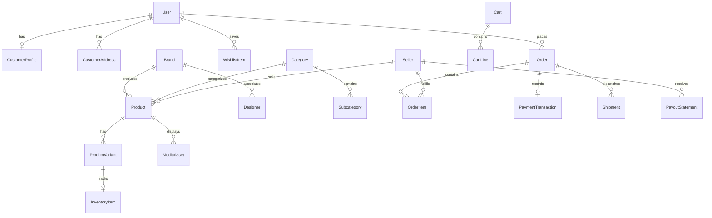

# OGURA — Comprehensive Master Forensic, Hardening & Backend Contract Report
**Version:** 2.0 (Master Unified Edition)  
**Date:** 2026-09-14  
**Workspace:** `/Users/samarth/Downloads/STUFF/WORK/Personal/OguraMVP`  
**Framework:** TanStack Start (Nitro SSR + Vite 8 + React 19 + TypeScript + Tailwind CSS v4)  
**Authoritative Sources Reconciled:**
1. `.lovable/plan/ogura-frontend-only-prototype-2026-09-08.md` (Lovable Prototype Plan)
2. `DOCS/frontend.md` (Frontend Forensic Extraction Baseline)
3. Existing source code (`src/routes/`, `src/state/`, `src/repositories/`, `src/domain/`, `src/data/`, `src/lib/`)
4. System configurations (`package.json`, `tsconfig.json`, `vite.config.ts`, `eslint.config.js`)

---

# TABLE OF CONTENTS
1. [Executive Summary & Verification Status](#1-executive-summary--verification-status)
2. [Re-Validation of Previous Frontend Fixes](#2-re-validation-of-previous-frontend-fixes)
3. [Master Issue Register & Forensic Classifications](#3-master-issue-register--forensic-classifications)
4. [Hard Product Lock Governance](#4-hard-product-lock-governance)
5. [Backend Endpoint Inventory (BE-001 to BE-036)](#5-backend-endpoint-inventory-be-001-to-be-036)
   - [Public Catalog (BE-001 – BE-008)](#domain-1-public-catalog)
   - [Customer & Commerce (BE-009 – BE-021)](#domain-2-customer--commerce)
   - [Made to Order (BE-022 – BE-023)](#domain-3-made-to-order-mto)
   - [Seller Atelier Portal (BE-024 – BE-028)](#domain-4-seller-atelier-portal)
   - [Admin Control Plane (BE-029 – BE-032)](#domain-5-admin-control-plane)
   - [Media & Storage (BE-033 – BE-034)](#domain-6-media-storage--cdn)
   - [System & Automation (BE-035 – BE-036)](#domain-7-system--automation)
6. [Frontend Repository Method Mapping](#6-frontend-repository-method-mapping)
7. [Browser Persistence & LocalStorage Migration Plan](#7-browser-persistence--localstorage-migration-plan)
8. [Comprehensive State Machine Specifications](#8-comprehensive-state-machine-specifications)
9. [Database Entity Schema & Relationship Map (23 Entities)](#9-database-entity-schema--relationship-map-23-entities)
10. [Financial Authority & Currency Calculation Map](#10-financial-authority--currency-calculation-map)
11. [Client → Server Security Trust Boundary](#11-client--server-security-trust-boundary)
12. [Third-Party External Services & Gateway Integrations](#12-third-party-external-services--gateway-integrations)
13. [Commercial Conflict Matrix & Required Architectural Decisions](#13-commercial-conflict-matrix--required-architectural-decisions)
14. [Verification Results & Build Telemetry](#14-verification-results--build-telemetry)
15. [Backend Handoff Declaration](#15-backend-handoff-declaration)

---

## 1. Executive Summary & Verification Status

This document constitutes the single, exhaustive source of truth for the OGURA frontend hardening, forensic auditing, and backend architectural handoff. 

The application is an MVP storefront built on TanStack Start with file-based routing under `src/routes/`. The frontend prototype was intentionally constructed without a live database, authentication provider, payment processor, or server infrastructure. All catalog data (311 product styles, 1,463 variants, 42 designers, 28 brands) is stored in client-side TypeScript structures and JSON files, while user states (cart, buy-now, wishlist, session, checkout drafts, orders) are maintained in browser `localStorage`.

### Key Metrics Summary:
- **Total Registered Routes:** 47
- **Total Core Reusable Components:** 11
- **Total Frontend Repositories:** 6 (`Catalog`, `Cart`, `Wishlist`, `Account`, `Checkout`, `ProductMedia`)
- **Total Repository Methods Mapped:** 23
- **Total Local Storage Keys Audited:** 10 (8 active, 2 dead)
- **Total Identified Backend Operations:** 36 (`BE-001` through `BE-036`)
- **Total Database Entities Specified:** 23
- **Total Core State Machines Documented:** 8
- **Total Unresolved Product Blockers:** 2 (Canonical Shipping Tariff & Made-to-Order Request Flow)
- **Application Build Status:** **PASS** (Zero compiler errors, zero runtime build breaks)
- **TypeScript Status:** **PASS** (Zero type errors in `tsc --noEmit`)

---

## 2. Re-Validation of Previous Frontend Fixes

Three specific frontend defects were resolved during the controlled hardening pass. All three have been re-verified against the actual repository source code:

| Fix Ref | Component / Source File | Target Defect | Applied Code Correction | Forensic Verification Result |
|---|---|---|---|---|
| **FIX-A** | `src/state/store.ts:88-112` | **In-Place Cart Mutation & Unclamped Quantities**<br>Calling `addToCart` previously mutated existing line item objects in-place within the external store array. Floating point, negative, or zero quantities could be pushed into state. | Replaced in-place object mutation with an immutable array `.map()` pattern. Enforced integer sanitization via `Math.max(1, Math.min(10, Math.floor(quantity) \|\| 1))`. Line items now update with fresh references for React store synchronization. | **PASS**<br>`src/state/store.ts` correctly verifies immutability and clamps quantities between 1 and 10. |
| **FIX-B** | `src/routes/account.profile.tsx:20-27` | **Profile Form Hydration Staleness**<br>`useState({ name: profile.name, ... })` initialized once upon component mount. When `hydrate()` ran asynchronously in `__root.tsx`, the local profile form remained blank or stuck on `GUEST`. | Added an explicit `useEffect` synchronization hook monitoring `[profile.name, profile.email, profile.phone]` to re-populate form state immediately upon `localStorage` rehydration. | **PASS**<br>`account.profile.tsx` successfully synchronizes local form state upon store hydration. |
| **FIX-C** | `src/routes/account.addresses.tsx:31-35` | **Phantom Saved Address Cards**<br>`EMPTY_DRAFT` initialized with empty strings for `fullName` and `line1`. If a user visited `/checkout`, an incomplete draft address would be rendered as a blank address card on `/account/addresses`. | Added a strict completeness predicate: `hasDraftAddress = Boolean(draftAddress?.fullName?.trim() && draftAddress?.line1?.trim())`. Incomplete draft records are excluded from saved address cards. | **PASS**<br>`account.addresses.tsx` only renders draft addresses if both `fullName` and `line1` contain non-whitespace text. |

---

## 3. Master Issue Register & Forensic Classifications

Every finding discovered in the OGURA codebase has been audited, categorized, and assigned a strict protocol classification:
- **Category A:** Confirmed Frontend Defect (Safely fixable without product/UI/UX change)
- **Category B:** Already Defined by Authoritative Requirement (Fixable to align with specs)
- **Category C:** Backend Dependency (Cannot be faked in frontend; deferred to server)
- **Category D:** Product/Business Decision Required (Multiple valid paths; stopped for human decision)
- **Category E:** UI/UX/Taxonomy Change Required (Real issue, but requires redesign; locked)
- **Category F:** Technical Debt / Non-Blocking (Harmless artifact; left unchanged)

| Issue ID | Severity | Description & Evidence | Classification | Current State & Action |
|---|---|---|---|---|
| **ISS-01** | **CRITICAL** | **Shipping Tariff Calculation Conflict**<br>• `src/routes/cart.tsx:33`: ₹149 below ₹2,999; free ≥ ₹2,999.<br>• `src/routes/checkout.tsx:48`: ₹99 standard / ₹249 express below ₹2,999; free ≥ ₹2,999.<br>• `src/repositories/mock/index.ts:104`: Flat ₹99 below ₹2,999; free ≥ ₹2,999.<br>• `src/routes/shipping.tsx:16-33`: States standard is free above ₹2,999, but mentions no sub-threshold pricing or express fee. | **Category D (Product Decision Required)** | **BLOCKED — SHIPPING DECISION REQUIRED**.<br>Engineering cannot pick ₹99 vs ₹149 or express handling arbitrarily. Awaiting commercial sign-off. |
| **ISS-02** | **HIGH** | **Dead Link to Nonexistent `/made-to-order/request`**<br>• `src/data/mockMerchandising.ts:37`: Links to `/made-to-order/request` ("Start a request").<br>• `src/data/mockMerchandising.ts:43`: Links to `/made-to-order/request?intent=footwear` ("Start your request").<br>• `src/routes/product.$productSlug.tsx:389`: Links to `/made-to-order/request`.<br>No route or intake handler exists in `src/routes/` (only `/made-to-order` PLP exists). Triggers 404. | **Category D (Product Decision Required)** / **Category E (UI/UX Lock)** | **BLOCKED — MTO FLOW DECISION REQUIRED**.<br>Inventing an intake form, concierge flow, or redirecting violates Hard Product Lock without architectural sign-off. |
| **ISS-03** | **MEDIUM** | **Multi-Seller Cart Presentation Discrepancy**<br>Lovable Prototype Plan (`.lovable/plan/...:22`) specifies: *"cart page grouped by seller"*. Actual implementation (`src/routes/cart.tsx:58-110`) renders a single flat list of items. | **Category E (UI/UX Lock)** | **DEFERRED — HARD PRODUCT LOCK**.<br>Altering cart layout violates visual design freeze. Backend multi-seller split orders will be built to support both flat and grouped presentations. |
| **ISS-04** | **CRITICAL** | **Client-Authoritative Financial Math**<br>`src/routes/checkout.tsx:44-55` and `src/repositories/mock/index.ts:98-115` calculate subtotal, discounts, shipping, and grand total entirely inside client memory. | **Category C (Backend Dependency)** | **BACKEND DEPENDENCY — DEFERRED**.<br>Frontend will display quotes; backend quote engine must calculate all payable amounts before payment gateway order creation. |
| **ISS-05** | **CRITICAL** | **Client-Side Order Creation & ID Generation**<br>`src/repositories/mock/index.ts:106` generates `DEMO-OG-XXXX` random numbers, marks status as `placed`, and saves directly to `localStorage.ogura.orders`. | **Category C (Backend Dependency)** | **BACKEND DEPENDENCY — DEFERRED**.<br>Order sequence generation, validation, state machine progression, and persistence must belong strictly to PostgreSQL. |
| **ISS-06** | **HIGH** | **Unverified Client Authentication**<br>`src/state/store.ts:182` allows setting `signedIn: true` from unverified client forms without password, OTP, JWT, or server verification. | **Category C (Backend Dependency)** | **BACKEND DEPENDENCY — DEFERRED**.<br>Server OTP verification service and secure session cookie/JWT management must be implemented on the backend. |
| **ISS-07** | **HIGH** | **Client-Only Seller / Admin Route Guards**<br>`src/routes/seller.tsx:11-28` and `src/routes/admin.tsx:11-28` rely purely on client role checks. Sensitive data and mutation logic are unprotected by server middleware. | **Category C (Backend Dependency)** | **BACKEND DEPENDENCY — DEFERRED**.<br>Server-side RBAC and database Row-Level Security (RLS) must enforce tenant isolation and administrative access. |
| **ISS-08** | **HIGH** | **Static In-Memory Inventory Checks**<br>`src/routes/product.$productSlug.tsx:92-93` computes stock availability via deterministic modulo calculations (`product.id % 7 === 0`). No concurrency safety or decrement holds exist. | **Category C (Backend Dependency)** | **BACKEND DEPENDENCY — DEFERRED**.<br>PostgreSQL atomic reservation (`SELECT FOR UPDATE`) or Redis lock holds must enforce inventory availability during checkout. |
| **ISS-09** | **MEDIUM** | **Product Media Google Drive Coupling**<br>`src/repositories/mock/productMediaRepository.ts` reads `productMediaManifest` pointing to temporary Google Drive thumbnail exports (`lh3.googleusercontent.com`). Code contains `TEMPORARY_DRIVE_MEDIA` tags. | **Category C (Backend Dependency)** | **BACKEND DEPENDENCY — DEFERRED**.<br>All 311 product images must be migrated to dedicated cloud object storage (Cloudflare R2 / AWS S3) behind a high-speed CDN. |
| **ISS-10** | **LOW** | **Dead LocalStorage Keys**<br>`KEYS.addresses` and `KEYS.reviews` are declared in `src/lib/storage.ts:30-31` but never read or written anywhere in the codebase. | **Category F (Technical Debt)** | **NOT A DEFECT — NO CHANGE**.<br>Unused keys do not impact runtime execution, bundle size, or type checking. Left untouched as harmless debt. |
| **ISS-11** | **MEDIUM** | **Procedural In-Memory Review Generation**<br>`src/data/mockReviews.ts:37` procedurally synthesizes fake buyer reviews in memory for PDP display. No persistent review submission or verified buyer check exists. | **Category C (Backend Dependency)** | **BACKEND DEPENDENCY — DEFERRED**.<br>PostgreSQL `reviews` table linked to verified order line items must be implemented. |
| **ISS-12** | **MEDIUM** | **Synthetic Delivery ETA Estimator**<br>`src/routes/product.$productSlug.tsx:396-418` accepts a 6-digit pincode but returns a hardcoded mock text response ("Delivers in 4–6 days") without querying courier APIs. | **Category C (Backend Dependency)** | **BACKEND DEPENDENCY — DEFERRED**.<br>Logistics carrier serviceability API (Shiprocket / Delhivery) must be queried based on seller origin and customer destination. |
| **ISS-13** | **MEDIUM** | **Missing Customer Return & Cancellation Flow**<br>`src/routes/account.orders.tsx` renders past orders as static read-only cards without buttons to initiate returns, cancellations, or exchanges. `src/routes/returns.tsx` is static policy copy. | **Category D / Category C** | **BACKEND DEPENDENCY & PRODUCT DECISION**.<br>Interactive return intake and cancellation policy window must be specified before backend API implementation. |
| **ISS-14** | **MEDIUM** | **Seller Order Fulfillment Lacks AWB / Carrier Entry**<br>`src/routes/seller.orders.tsx:40` renders action buttons that do not trigger API mutations, generate shipping labels, or capture carrier tracking numbers. | **Category C (Backend Dependency)** | **BACKEND DEPENDENCY — DEFERRED**.<br>Seller order fulfillment endpoints must generate carrier manifests, AWBs, and update shipping state machines. |
| **ISS-15** | **MEDIUM** | **Seller Payouts Are Static Mock Metrics**<br>`src/routes/seller.payouts.tsx:15-45` displays hardcoded past payout tables and pending balance figures without financial ledger calculation or bank account validation. | **Category C (Backend Dependency)** | **BACKEND DEPENDENCY — DEFERRED**.<br>Automated financial settlement engine calculating net payouts, platform commission, GST, and banking UTRs must be built on the backend. |

---

## 4. Hard Product Lock Governance

To ensure brand integrity and avoid accidental regressions while preparing for backend engineering, the following elements are strictly **LOCKED**:

1. **Visual Design & Styling:** Typography (Cormorant Garamond + Manrope), color tokens (`charcoal`, `wine`, `rose`, `sand`, `surface`, `border`), spacing scale, dark editorial luxury aesthetic.
2. **Information Architecture & Routes:** All 47 existing route definitions in `src/routes/` and navigation trees in `src/config/navigation.ts`.
3. **Product Taxonomy:** Hard category structure (Clothing, Ethnicwear, Footwear, Accessories), subcategories, filter groupings, and merchandising hierarchy.
4. **Catalog Data Integrity:** 311 product styles and 1,463 SKUs generated from the master workbook, price tier bands (₹1,111 – ₹15,000; exactly 202 styles in ₹1,111 – ₹2,999).
5. **Component Anatomy:** ProductCard badge hierarchy, PLP 24-batch pagination engine, 12-section PDP layout, sticky mobile action bars.
6. **Commerce Surface:** Cart presentation (flat list maintained), 5-step checkout layout, order success presentation.

---

## 5. Backend Endpoint Inventory (BE-001 to BE-036)

This is the comprehensive, canonical backend operation inventory reverse-engineered from every UI component and data flow in OGURA.

---

### Domain 1: Public Catalog

#### BE-001 — List Products with Filtering, Facets & Sorting (PLP Engine)
- **Frontend location:** `src/components/plp/PlpEngine.tsx:75-102`, `src/repositories/mock/index.ts:14-16`
- **Frontend trigger:** Navigating to `/shop`, `/new-in`, `/women/$categorySlug`, `/women/$categorySlug/$subcategorySlug`, `/occasions/$occasionSlug`, `/collections/$collectionSlug`, `/brand/$brandSlug`, `/designer/$designerSlug`, `/made-to-order`.
- **Current implementation:** `mockCatalogRepository.listProducts(query)` running in-memory array filters with synthetic 150–300ms delay.
- **Operation:** `GET` / `RPC`
- **Entity:** `Product`, `ProductVariant`, `Brand`, `Designer`, `Category`, `Subcategory`
- **Input:**
  ```json
  {
    "category": "clothing",
    "subcategory": "dresses-and-jumpsuits",
    "brand": "studio-amala",
    "designer": "ananya-verma",
    "occasion": "evening-cocktail",
    "collection": "under-3000",
    "priceRange": [1500, 5000],
    "colors": ["Ivory", "Crimson"],
    "sizes": ["S", "M"],
    "inStockOnly": true,
    "madeToOrder": false,
    "query": "silk",
    "sort": "price-asc",
    "batch": 1,
    "pageSize": 24
  }
  ```
- **Output:**
  ```json
  {
    "products": [
      {
        "id": "prod_01",
        "slug": "ivory-raw-silk-kurta",
        "title": "Ivory Raw Silk Kurta",
        "brandName": "Studio Amala",
        "brandSlug": "studio-amala",
        "category": "ethnicwear",
        "subcategory": "kurtas",
        "price": 2499,
        "compareAtPrice": 3299,
        "primaryImage": "https://cdn.ogura.in/catalog/prod_01/primary.webp",
        "secondaryImage": "https://cdn.ogura.in/catalog/prod_01/secondary.webp",
        "inStock": true,
        "isLowStock": false,
        "madeToOrder": false,
        "rating": 4.8,
        "reviewCount": 12
      }
    ],
    "total": 311,
    "batch": 1,
    "pageSize": 24,
    "facets": {
      "brands": [{ "slug": "studio-amala", "name": "Studio Amala", "count": 28 }],
      "categories": [{ "slug": "clothing", "count": 140 }],
      "sizes": ["XS", "S", "M", "L", "XL"],
      "colors": ["Black", "Ivory", "Wine", "Indigo"],
      "priceBounds": { "min": 1111, "max": 15000 }
    }
  }
  ```
- **Frontend authority:** Frontend supplies query params and manages infinite-batch (+24 styles) scrolling.
- **Backend authority required:** Server executes indexed SQL queries, validates price boundaries, filters out non-published styles, and computes aggregation counts.
- **Authentication required:** NO | **Authorization:** `PUBLIC`
- **Financial impact:** LOW | **Concurrency concern:** NONE | **Provider:** PostgreSQL / Elastic

---

#### BE-002 — Get Product Detail by Slug (PDP)
- **Frontend location:** `src/routes/product.$productSlug.tsx:48-60`, `src/repositories/mock/index.ts:18-20`
- **Frontend trigger:** Navigating to `/product/$productSlug`.
- **Current implementation:** `mockCatalogRepository.getProductBySlug(slug)` finding matching item in static array.
- **Operation:** `GET`
- **Entity:** `Product`, `ProductVariant`, `Brand`, `Designer`, `ProductMedia`, `ProductReview`
- **Input:** `{ "slug": "silk-organza-saree" }`
- **Output:** Complete product aggregate (details, full SKU variant matrix with sizes and stock counts, multi-angle media gallery, designer biography, brand story, aggregated review ratings).
- **Frontend authority:** React state selects active size/color variant.
- **Backend authority required:** Server validates product active state, loads verified variants, and enforces authoritative pricing.
- **Authentication required:** NO | **Authorization:** `PUBLIC`
- **Financial impact:** LOW | **Concurrency concern:** NONE | **Provider:** PostgreSQL

---

#### BE-003 — Full-Text Catalog Autocomplete & Quick Search
- **Frontend location:** `src/components/layout/SearchOverlay.tsx:42-55`, `src/repositories/mock/index.ts:22-24`
- **Frontend trigger:** User types >= 2 characters in header search overlay.
- **Current implementation:** In-memory regex filtering across product titles, brand names, and categories.
- **Operation:** `GET`
- **Entity:** `Product`, `Brand`, `Designer`
- **Input:** `{ "query": "chikankari", "limit": 6 }`
- **Output:** Categorized search results: top matching products (with thumbnails and prices), matching brand ateliers, and matching designers.
- **Frontend authority:** Debounces input (300ms) and manages search history in `localStorage`.
- **Backend authority required:** Sub-50ms database full-text search index (PostgreSQL `pg_trgm` / `tsvector`).
- **Authentication required:** NO | **Authorization:** `PUBLIC`
- **Financial impact:** NONE | **Concurrency concern:** NONE | **Provider:** PostgreSQL / Meilisearch

---

#### BE-004 — List Brands & Get Brand Details
- **Frontend location:** `src/routes/brands.tsx:35`, `src/routes/brand.$brandSlug.tsx:28`, `src/data/mockBrands.ts`
- **Frontend trigger:** User visits `/brands` directory or `/brand/$brandSlug`.
- **Current implementation:** Static JSON array `mockBrands`.
- **Operation:** `GET`
- **Entity:** `Brand`, `Product`
- **Input:** `{ "slug"?: "studio-amala" }`
- **Output:** Brand metadata (name, origin city, state, brand philosophy, logo URL, curated styles list).
- **Frontend authority:** None.
- **Backend authority required:** Database query on `brands` table.
- **Authentication required:** NO | **Authorization:** `PUBLIC`
- **Financial impact:** NONE | **Concurrency concern:** NONE | **Provider:** PostgreSQL

---

#### BE-005 — List Designers & Get Designer Details
- **Frontend location:** `src/routes/designers.tsx:35`, `src/routes/designer.$designerSlug.tsx:28`, `src/data/mockDesigners.ts`
- **Frontend trigger:** Navigating to `/designers` or `/designer/$designerSlug`.
- **Current implementation:** Static JSON array `mockDesigners`.
- **Operation:** `GET`
- **Entity:** `Designer`, `Brand`, `Product`
- **Input:** `{ "slug"?: "ananya-verma" }`
- **Output:** Designer bio, studio location, design philosophy, portrait image, linked brands, product styles.
- **Frontend authority:** None.
- **Backend authority required:** Database query on `designers` table.
- **Authentication required:** NO | **Authorization:** `PUBLIC`
- **Financial impact:** NONE | **Concurrency concern:** NONE | **Provider:** PostgreSQL

---

#### BE-006 — List Curated Collections & Criteria Rules
- **Frontend location:** `src/routes/collections.index.tsx:28`, `src/routes/collections.$collectionSlug.tsx:26`, `src/data/mockCollections.ts`
- **Frontend trigger:** Navigating to `/collections` or price/theme edits (e.g. `/collections/under-2000`).
- **Current implementation:** Static `mockCollections` array with filtering rules.
- **Operation:** `GET`
- **Entity:** `Collection`, `CollectionRule`
- **Input:** `{ "slug"?: "under-3000" }`
- **Output:** Collection title, editorial description, banner image, criteria rules (e.g. price <= 2999).
- **Frontend authority:** None.
- **Backend authority required:** Dynamic rule evaluation or manual curation table.
- **Authentication required:** NO | **Authorization:** `PUBLIC`
- **Financial impact:** NONE | **Concurrency concern:** NONE | **Provider:** PostgreSQL

---

#### BE-007 — List Occasions & Aesthetic Edits
- **Frontend location:** `src/routes/occasions.tsx:25`, `src/routes/occasion.$occasionSlug.tsx:28`, `src/data/mockOccasions.ts`
- **Frontend trigger:** Navigating to `/occasions` or `/occasion/$occasionSlug`.
- **Current implementation:** Static `mockOccasions` array.
- **Operation:** `GET`
- **Entity:** `Occasion`, `Product`
- **Input:** `{ "slug"?: "festive" }`
- **Output:** Occasion title, styling notes, mood image, matching product tags.
- **Frontend authority:** None.
- **Backend authority required:** PostgreSQL registry of occasions.
- **Authentication required:** NO | **Authorization:** `PUBLIC`
- **Financial impact:** NONE | **Concurrency concern:** NONE | **Provider:** PostgreSQL

---

#### BE-008 — Merchandising Banners & Editorial Grid Inserts
- **Frontend location:** `src/data/mockMerchandising.ts:1-110`, `src/components/plp/PlpEngine.tsx:142-160`
- **Frontend trigger:** PLP rendering editorial cards after product index 12 and 36.
- **Current implementation:** Static mapping by category in `src/data/mockMerchandising.ts`.
- **Operation:** `GET`
- **Entity:** `MerchandisingInsert`, `Campaign`
- **Input:** `{ "categorySlug": "ethnicwear" }`
- **Output:** Category banner text, chip filters, insert12 (e.g. Craft Spotlight), insert36 (e.g. Made to Order CTA).
- **Frontend authority:** Injects cards into product grid without consuming numeric product slots.
- **Backend authority required:** Dynamic CMS campaign scheduling engine.
- **Authentication required:** NO | **Authorization:** `PUBLIC`
- **Financial impact:** NONE | **Concurrency concern:** NONE | **Provider:** PostgreSQL

---

### Domain 2: Customer & Commerce

#### BE-009 — Customer Sign In / Phone OTP Request & Verification
- **Frontend location:** `src/routes/account.profile.tsx:34-40`, `src/state/store.ts:182-185`
- **Frontend trigger:** Customer enters phone/email and clicks "Save details" / Sign In.
- **Current implementation:** Client calls `signIn({ ...form, signedIn: true })` writing unverified data to `localStorage.ogura.session`.
- **Operation:** `RPC` / `ACTION`
- **Entity:** `User`, `CustomerProfile`, `AuthSession`
- **Input:** `{ "phone": "+919876543210", "otp"?: "123456" }`
- **Output:** Verified User record, CustomerProfile, cryptographic JWT session token, expiration timestamp.
- **Frontend authority:** Client currently fabricates signed-in state from unvalidated text.
- **Backend authority required:** Server MUST generate 6-digit OTP, dispatch via SMS gateway, verify against rate limits, create/update User record, and issue signed JWT/httpOnly cookie.
- **Authentication required:** NO (Entry Point) | **Authorization:** `PUBLIC`
- **State transition:** `UNAUTHENTICATED → AUTHENTICATED`
- **Validation:** 10-digit Indian mobile regex (`/^[6-9]\d{9}$/`), 6-digit numeric OTP, rate limit: max 3 attempts per 5 minutes.
- **Financial impact:** LOW (SMS dispatch costs) | **Concurrency concern:** NONE | **Provider:** Twilio / Gupshup / Fast2SMS

---

#### BE-010 — Customer Sign Out / Revoke Session
- **Frontend location:** `src/routes/account.profile.tsx:45-51`, `src/state/store.ts:187-190`
- **Frontend trigger:** Customer clicks "Sign out" on profile page.
- **Current implementation:** Overwrites `KEYS.session` in localStorage with `GUEST` object.
- **Operation:** `ACTION` / `RPC`
- **Entity:** `AuthSession`
- **Input:** None (Session identified by Bearer token or httpOnly cookie)
- **Output:** `{ "success": true }`
- **Frontend authority:** Clears local state and localStorage.
- **Backend authority required:** Revoke session token and refresh token in database session store.
- **Authentication required:** YES | **Authorization:** `CUSTOMER`
- **State transition:** `AUTHENTICATED → TERMINATED`
- **Financial impact:** NONE | **Concurrency concern:** NONE | **Provider:** Internal Auth Store

---

#### BE-011 — Get & Update Customer Profile
- **Frontend location:** `src/routes/account.profile.tsx:21-40`, `src/routes/account.index.tsx:21`
- **Frontend trigger:** Loading account dashboard or editing name/email.
- **Current implementation:** Reads and writes `localStorage.ogura.session`.
- **Operation:** `GET` / `UPDATE`
- **Entity:** `CustomerProfile`
- **Input:** `{ "name": "Aarav Sharma", "email": "aarav@example.com" }`
- **Output:** Authoritative `CustomerProfile` record.
- **Frontend authority:** Client currently controls profile fields directly.
- **Backend authority required:** Validate email format, enforce phone uniqueness, update PostgreSQL profile table under `auth.uid() = user_id`.
- **Authentication required:** YES | **Authorization:** `CUSTOMER` (Own profile only)
- **Financial impact:** NONE | **Concurrency concern:** NONE | **Provider:** PostgreSQL

---

#### BE-012 — List, Add & Delete Customer Saved Addresses
- **Frontend location:** `src/routes/account.addresses.tsx:31-75`
- **Frontend trigger:** Customer navigates to `/account/addresses` or adds delivery address.
- **Current implementation:** Local React state array merged with `checkoutDraft?.address`.
- **Operation:** `GET` / `CREATE` / `DELETE`
- **Entity:** `CustomerAddress`
- **Input:**
  ```json
  {
    "fullName": "Priya Sen",
    "phone": "9876543210",
    "line1": "Flat 402, Lotus Towers",
    "line2": "Indiranagar",
    "city": "Bengaluru",
    "state": "Karnataka",
    "pincode": "560038",
    "isDefault": true
  }
  ```
- **Output:** Array of persistent `CustomerAddress` records.
- **Frontend authority:** Client manages array in memory.
- **Backend authority required:** Persistent PostgreSQL table with `user_id` foreign key, single default address constraint, and pincode format validation.
- **Authentication required:** YES | **Authorization:** `CUSTOMER` (Own records only)
- **Validation:** 6-digit Indian pincode (`/^\d{6}$/`), 10-digit mobile phone, mandatory street address.
- **Financial impact:** NONE | **Concurrency concern:** NONE | **Provider:** PostgreSQL

---

#### BE-013 — Get Customer Wishlist & Toggle Product
- **Frontend location:** `src/state/store.ts:137-144`, `src/routes/wishlist.tsx:22`, `src/routes/account.wishlist.tsx:22`
- **Frontend trigger:** Customer clicks heart icon on product card or PDP.
- **Current implementation:** Array of string product IDs in `localStorage.ogura.wishlist`.
- **Operation:** `GET` / `RPC` (`toggleWishlist`)
- **Entity:** `WishlistItem`
- **Input:** `{ "productId": "prod_01" }`
- **Output:** `{ "wishlist": ["prod_01", "prod_05"], "added": true }`
- **Frontend authority:** Frontend toggles IDs locally.
- **Backend authority required:** Database table `wishlist_items (user_id, product_id, created_at)` with unique constraint.
- **Authentication required:** YES (Guest wishlist merges to database upon login) | **Authorization:** `CUSTOMER`
- **Financial impact:** NONE | **Concurrency concern:** NONE | **Provider:** PostgreSQL

---

#### BE-014 — Synchronize & Fetch Persistent Customer Cart
- **Frontend location:** `src/state/store.ts:88-128`, `src/routes/cart.tsx:22-45`
- **Frontend trigger:** Adding SKU to cart, updating quantity (1–10), removing line, clearing cart.
- **Current implementation:** Local JSON object `{ lines: [] }` in `localStorage.ogura.cart`.
- **Operation:** `GET` / `UPDATE` / `RPC`
- **Entity:** `Cart`, `CartLine`
- **Input:** `{ "action": "ADD_LINE", "variantId": "var_01", "quantity": 1 }`
- **Output:** Authoritative cart object with active prices, live stock flags, and line totals.
- **Frontend authority:** Frontend maintains local line state.
- **Backend authority required:** Server validates real stock per SKU, recalculates line totals using authoritative database prices (ignoring client prices), and persists cart across devices.
- **Authentication required:** OPTIONAL (Session cookie for guests, `user_id` for logged-in users)
- **Authorization:** `CUSTOMER` / `PUBLIC` (Guest cart)
- **State transition:** `ACTIVE → CHECKOUT → CONVERTED`
- **Validation:** Max 10 items per line, variant must exist and belong to active product.
- **Financial impact:** HIGH (Governs cart subtotal) | **Concurrency concern:** NONE at cart phase
- **Dependencies:** `Cart`, `CartLine`, `ProductVariant`

---

#### BE-015 — Check Pincode Delivery Serviceability & Live ETA
- **Frontend location:** `src/routes/product.$productSlug.tsx:396-418`, `src/routes/shipping.tsx:16-33`
- **Frontend trigger:** Customer enters 6-digit pincode on PDP and clicks "Check".
- **Current implementation:** Mock string lookup returning "Delivers in 4–6 days" after synthetic 250ms delay.
- **Operation:** `GET` / `RPC`
- **Entity:** `LogisticsPartner`, `PincodeServiceability`
- **Input:** `{ "pincode": "560001", "productId": "prod_01" }`
- **Output:** Serviceability boolean, city, state, standard delivery ETA range (days), express delivery availability and ETA.
- **Frontend authority:** Manages input text state.
- **Backend authority required:** Logistics partner serviceability matrix query checking seller dispatch pincode against destination pincode.
- **Authentication required:** NO | **Authorization:** `PUBLIC`
- **Validation:** Pincode must be exactly 6 numeric digits.
- **Financial impact:** LOW | **Concurrency concern:** NONE | **Provider:** Shiprocket / Delhivery API

---

#### BE-016 — Validate Checkout Draft & Generate Authoritative Financial Quote
- **Frontend location:** `src/routes/checkout.tsx:44-55, 80-92`, `src/repositories/mock/index.ts:82` (`validateDraft`)
- **Frontend trigger:** Navigating between checkout steps or toggling delivery method.
- **Current implementation:** Client computes subtotal, applies conflicting shipping rules, and generates grand total.
- **Operation:** `RPC` / `ACTION`
- **Entity:** `CheckoutQuote`, `OrderDraft`
- **Input:**
  ```json
  {
    "items": [{ "variantId": "var_01", "quantity": 1 }],
    "deliveryMethod": "standard",
    "address": {
      "fullName": "Priya Sen",
      "phone": "9876543210",
      "line1": "Flat 402, Lotus Towers",
      "city": "Bengaluru",
      "state": "Karnataka",
      "pincode": "560038"
    },
    "couponCode": ""
  }
  ```
- **Output:**
  ```json
  {
    "quoteId": "quote_77192",
    "validUntil": "2026-09-14T23:45:00Z",
    "subtotal": 4999,
    "discount": 0,
    "shippingFee": 0,
    "taxAmount": 0,
    "totalPayable": 4999,
    "currency": "INR",
    "inventoryReserved": true,
    "errors": {}
  }
  ```
- **Frontend authority:** Client currently calculates all financial numbers.
- **Backend authority required:** Backend MUST calculate subtotal from active database prices, apply canonical shipping rule, validate coupon validity, calculate GST if applicable, and temporarily reserve inventory lock (e.g. 15-minute lock).
- **Authentication required:** OPTIONAL | **Authorization:** `PUBLIC` / `CUSTOMER`
- **State transition:** `DRAFT → QUOTED_AND_HELD`
- **Validation:** Address completeness, phone regex, SKU availability > 0, coupon validity.
- **Financial impact:** **CRITICAL** (Governs exact charge to customer)
- **Concurrency concern:** **REQUIRED** (Must verify stock availability before holding)
- **Dependencies:** `ProductVariant`, `InventoryItem`, `Coupon`
- **Open question:** Canonical shipping rate decision (Conflict F-01).

---

#### BE-017 — Initiate Payment Order with Gateway
- **Frontend location:** `src/routes/checkout.tsx:94-100`
- **Frontend trigger:** Customer clicks "Complete order" at final checkout step.
- **Current implementation:** Bypassed completely; invokes mock order creation immediately.
- **Operation:** `ACTION` / `RPC`
- **Entity:** `PaymentIntent`, `GatewayOrder`
- **Input:** `{ "quoteId": "quote_77192", "paymentMethod": "upi" }`
- **Output:** Gateway order ID, public API key, exact amount in paise, currency ("INR"), customer contact payload.
- **Frontend authority:** None.
- **Backend authority required:** Server communicates with payment gateway API using private secret credentials to create an immutable payment order.
- **Authentication required:** OPTIONAL | **Authorization:** `CUSTOMER` / `PUBLIC`
- **State transition:** `QUOTE → PAYMENT_PENDING`
- **Validation:** Quote must not be expired; amount must be in paise (> 0).
- **Financial impact:** **CRITICAL** (Initializes real money transaction)
- **Concurrency concern:** REQUIRED | **Provider:** Razorpay / Cashfree API

---

#### BE-018 — Verify Payment Signature & Authoritatively Commit Order
- **Frontend location:** Downstream of payment gateway modal; verified via server webhook / callback.
- **Frontend trigger:** Gateway returns `razorpay_payment_id`, `razorpay_order_id`, `razorpay_signature`.
- **Current implementation:** Client fabricates `DEMO-OG-XXXX` ID, sets `status: "placed"`, and writes to `localStorage`.
- **Operation:** `ACTION` / `WEBHOOK`
- **Entity:** `Order`, `OrderItem`, `PaymentTransaction`, `InventoryItem`
- **Input:**
  ```json
  {
    "gatewayOrderId": "order_Rzp1029384",
    "gatewayPaymentId": "pay_Rzp554433",
    "gatewaySignature": "9f83ab...signature"
  }
  ```
- **Output:** Authoritative order confirmation (`orderNumber: "OG-2026-9812"`, `status: "placed"`, total, createdAt).
- **Frontend authority:** Client currently manufactures order records in localStorage.
- **Backend authority required:** Server MUST verify HMAC SHA256 signature using webhook secret, atomically deduct stock from `Inventory`, create `orders` and `order_items` records in PostgreSQL, mark quote consumed, and clear cart.
- **Authentication required:** NO (Webhook signature header) | **Authorization:** `SYSTEM` / `CUSTOMER`
- **State transition:** `PAYMENT_PENDING → PLACED (CONFIRMED)`
- **Validation:** Cryptographic signature verification, idempotent execution (duplicate webhook must not double-create order).
- **Financial impact:** **CRITICAL** (Reconciles real money)
- **Concurrency concern:** **REQUIRED** (Atomic inventory decrement inside transaction)
- **External provider:** Payment Gateway Webhook
- **Dependencies:** `orders`, `order_items`, `payments`, `inventory`

---

#### BE-019 — Get Order Detail by Order ID
- **Frontend location:** `src/routes/order.success.$orderId.tsx:21-35`, `src/repositories/mock/index.ts:68-70`
- **Frontend trigger:** Navigating to `/order/success/$orderId` or viewing order details from history.
- **Current implementation:** `mockAccountRepository.getOrder(orderNumber)` finding record in `localStorage.ogura.orders`.
- **Operation:** `GET`
- **Entity:** `Order`, `OrderItem`, `Shipment`
- **Input:** `{ "orderId": "OG-2026-9812" }`
- **Output:** Order metadata, line items (titles, variants, prices, quantities), subtotal, shipping, total, delivery address, payment method, tracking info.
- **Frontend authority:** None.
- **Backend authority required:** PostgreSQL query with customer ownership verification (guest orders viewable via signed token).
- **Authentication required:** OPTIONAL (Signed token or user login)
- **Authorization:** `CUSTOMER` (Own order) / `GUEST_WITH_TOKEN` / `ADMIN`
- **Financial impact:** LOW | **Concurrency concern:** NONE | **Provider:** PostgreSQL

---

#### BE-020 — List Customer Order History
- **Frontend location:** `src/routes/account.orders.tsx:20-45`, `src/repositories/mock/index.ts:64-66`
- **Frontend trigger:** Customer visits `/account/orders`.
- **Current implementation:** Reads `localStorage.ogura.orders`.
- **Operation:** `GET`
- **Entity:** `Order`
- **Input:** User session context (`auth.uid()`)
- **Output:** Array of `OrderSummary` records sorted by `created_at DESC`.
- **Frontend authority:** None.
- **Backend authority required:** Query PostgreSQL `orders` table filtered by `user_id`.
- **Authentication required:** YES | **Authorization:** `CUSTOMER` (`auth.uid() = user_id`)
- **Financial impact:** LOW | **Concurrency concern:** NONE | **Provider:** PostgreSQL

---

#### BE-021 — Track Order by Pincode & Order Number
- **Frontend location:** `src/routes/track-order.tsx:30-55`
- **Frontend trigger:** Customer enters order number and email/phone on `/track-order`.
- **Current implementation:** Static UI placeholder form.
- **Operation:** `GET` / `RPC`
- **Entity:** `Shipment`, `LogisticsEvent`
- **Input:** `{ "orderNumber": "OG-2026-9812", "phoneOrPincode": "560038" }`
- **Output:** Order tracking summary, carrier name, AWB tracking number, estimated delivery date, chronological event timeline.
- **Frontend authority:** None.
- **Backend authority required:** Logistics partner webhook synchronization and shipment status query.
- **Authentication required:** NO (Public lookup with order number + phone/pincode verification)
- **Authorization:** `PUBLIC`
- **Validation:** Order number and phone/pincode must match database record.
- **Financial impact:** NONE | **Concurrency concern:** NONE | **Provider:** Shiprocket / Delhivery API

---

### Domain 3: Made to Order (MTO)

#### BE-022 — Submit Made-to-Order (MTO) Request
- **Frontend location:** `src/data/mockMerchandising.ts:37, 43`, `src/routes/product.$productSlug.tsx:389`
- **Frontend trigger:** User clicks "Start a request" from MTO banner or PDP.
- **Current implementation:** Route is missing (404). Merchandising references `/made-to-order/request`.
- **Operation:** `CREATE`
- **Entity:** `MTORequest`
- **Input:**
  ```json
  {
    "productId": "prod_01",
    "variantId": "var_01",
    "intent": "footwear",
    "customerName": "Rhea Kapoor",
    "customerPhone": "9876543210",
    "customerEmail": "rhea@example.com",
    "measurements": { "bust": "34", "waist": "28", "hips": "38", "height": "5ft 6in" },
    "notes": "Need deeper neckline and delivery before Oct 15",
    "targetDate": "2026-10-15"
  }
  ```
- **Output:** `{ "requestId": "mto_8829", "referenceNumber": "MTO-OG-4412", "status": "submitted" }`
- **Frontend authority:** Missing in frontend.
- **Backend authority required:** Insert into `mto_requests` table, trigger notification to seller atelier, generate reference number.
- **Authentication required:** OPTIONAL (Captures contact info) | **Authorization:** `PUBLIC` / `CUSTOMER`
- **State transition:** `NULL → SUBMITTED`
- **Financial impact:** HIGH (Bespoke order value) | **Concurrency concern:** NONE
- **Dependencies:** `Product`, `Seller`, `mto_requests`

---

#### BE-023 — Get Made-to-Order Request Status
- **Frontend location:** Account or customer tracking view.
- **Operation:** `GET`
- **Entity:** `MTORequest`
- **Input:** `{ "requestId": "mto_8829" }`
- **Output:** Current bespoke status (`submitted`, `atelier_review`, `quote_provided`, `in_crafting`, `dispatched`), price quote, atelier notes.
- **Frontend authority:** None.
- **Backend authority required:** PostgreSQL query with access control.
- **Authentication required:** YES (Or signed reference token) | **Authorization:** `CUSTOMER` / `SELLER` / `ADMIN`
- **Financial impact:** HIGH | **Concurrency concern:** NONE | **Provider:** PostgreSQL

---

### Domain 4: Seller Atelier Portal

#### BE-024 — Get Seller Dashboard Overview Metrics
- **Frontend location:** `src/routes/seller.index.tsx:21-45`
- **Frontend trigger:** Seller visits `/seller`.
- **Current implementation:** Hardcoded static numbers (`totalSales: ₹4,82,900`, `activeStyles: 28`, `pendingFulfillment: 6`, `nextPayout: ₹1,12,400`).
- **Operation:** `GET`
- **Entity:** `SellerProfile`, `SellerMetric`
- **Input:** Seller session context (`auth.uid() → seller_id`)
- **Output:** Real-time aggregated seller metrics: gross sales, active live styles, pending fulfillment count, next scheduled payout date, accrued payout balance.
- **Frontend authority:** None (Hardcoded static numbers).
- **Backend authority required:** Real-time aggregation of seller's fulfilled order lines and ledger balance.
- **Authentication required:** YES | **Authorization:** `SELLER` (Tenancy enforcement)
- **Financial impact:** HIGH | **Concurrency concern:** NONE | **Provider:** PostgreSQL

---

#### BE-025 — List Seller Products & Inventory Levels
- **Frontend location:** `src/routes/seller.products.tsx:25-50`
- **Frontend trigger:** Seller visits `/seller/products`.
- **Current implementation:** Filters `mockProducts` array in memory by brand name.
- **Operation:** `GET`
- **Entity:** `Product`, `ProductVariant`, `InventoryItem`
- **Input:** Seller session context (`seller_id`), `page?: number`
- **Output:** Array of seller styles: title, slug, SKU, variant count, stock-on-hand, publication status.
- **Frontend authority:** None.
- **Backend authority required:** PostgreSQL query filtered strictly by `seller_id` via RLS.
- **Authentication required:** YES | **Authorization:** `SELLER` (Tenancy enforcement)
- **Financial impact:** MEDIUM | **Concurrency concern:** NONE | **Provider:** PostgreSQL

---

#### BE-026 — List Seller Orders & Sub-Orders
- **Frontend location:** `src/routes/seller.orders.tsx:22-48`
- **Frontend trigger:** Seller visits `/seller/orders`.
- **Current implementation:** Hardcoded static slice of 3 mock orders.
- **Operation:** `GET`
- **Entity:** `OrderItem`, `SellerSubOrder`
- **Input:** Seller session context (`seller_id`), `status?: string`
- **Output:** Array of line items assigned to seller: orderNumber, lineItemId, createdAt, destination city, SKU, size, quantity, seller payout price, fulfillment status.
- **Frontend authority:** None.
- **Backend authority required:** Query `order_items` joined with `orders` filtered strictly by `seller_id`.
- **Authentication required:** YES | **Authorization:** `SELLER`
- **Financial impact:** HIGH | **Concurrency concern:** NONE | **Provider:** PostgreSQL

---

#### BE-027 — Update Seller Order Fulfillment Status & Dispatch
- **Frontend location:** `src/routes/seller.orders.tsx:40`
- **Frontend trigger:** Seller marks line item as "Ready for pickup" or "Dispatched".
- **Current implementation:** Static button without event handler.
- **Operation:** `UPDATE` / `RPC`
- **Entity:** `OrderItem`, `Shipment`
- **Input:** `{ "lineItemId": "item_441", "status": "ready_to_ship", "pickupPincode": "302001", "packageWeightKg": 0.8 }`
- **Output:** `{ "success": true, "newStatus": "ready_to_ship", "awb": "DEL991823" }`
- **Frontend authority:** None.
- **Backend authority required:** Update sub-order state machine, notify courier partner to schedule pickup, emit notification to customer.
- **Authentication required:** YES | **Authorization:** `SELLER`
- **State transition:** `PLACED → READY_FOR_PICKUP → DISPATCHED`
- **Financial impact:** MEDIUM | **Concurrency concern:** NONE | **Provider:** Shiprocket / Delhivery API

---

#### BE-028 — Get Seller Payout History & Settlement Statements
- **Frontend location:** `src/routes/seller.payouts.tsx:21-45`
- **Frontend trigger:** Seller visits `/seller/payouts`.
- **Current implementation:** Hardcoded static array of past payout dates and amounts.
- **Operation:** `GET`
- **Entity:** `PayoutStatement`, `PayoutTransaction`
- **Input:** Seller session context (`seller_id`)
- **Output:** Pending balance, next payout date, past statements (statement ID, period, gross sales, platform commission deducted, logistics deductions, net paid, bank UTR number, payment timestamp).
- **Frontend authority:** None.
- **Backend authority required:** Financial ledger calculation in PostgreSQL based on settled shipments.
- **Authentication required:** YES | **Authorization:** `SELLER`
- **Financial impact:** **CRITICAL** (Financial accounting records) | **Concurrency concern:** NONE | **Provider:** RazorpayX / Cashfree Payouts

---

### Domain 5: Admin Control Plane

#### BE-029 — Get Admin Platform Overview Metrics
- **Frontend location:** `src/routes/admin.index.tsx:20-45`
- **Frontend trigger:** Admin opens `/admin`.
- **Current implementation:** Hardcoded static figures (`GMV: ₹42,90,000`, `Orders: 1,420`, `Styles: 311`, `Designers: 42`).
- **Operation:** `GET`
- **Entity:** `PlatformMetric`
- **Input:** Admin session context (`role = 'admin'`)
- **Output:** Real-time platform aggregates: GMV, order volume, live style count, registered designer count.
- **Frontend authority:** None.
- **Backend authority required:** PostgreSQL analytic query.
- **Authentication required:** YES | **Authorization:** `ADMIN`
- **Financial impact:** HIGH | **Concurrency concern:** NONE | **Provider:** PostgreSQL

---

#### BE-030 — Admin Catalog Master Listing & Moderation
- **Frontend location:** `src/routes/admin.catalog.tsx:22-50`
- **Frontend trigger:** Admin visits `/admin/catalog`.
- **Current implementation:** Renders table from static `mockProducts` array.
- **Operation:** `GET` / `UPDATE`
- **Entity:** `Product`
- **Input:** `{ "page": 1, "status": "all" }` or `{ "productId": "prod_01", "status": "suspended" }`
- **Output:** Paginated master catalog list or mutation confirmation.
- **Frontend authority:** None.
- **Backend authority required:** Global product catalog query bypassing seller tenancy filters.
- **Authentication required:** YES | **Authorization:** `ADMIN`
- **State transition:** `DRAFT ↔ PUBLISHED ↔ SUSPENDED`
- **Financial impact:** HIGH | **Concurrency concern:** NONE | **Provider:** PostgreSQL

---

#### BE-031 — Admin Master Orders Ledger
- **Frontend location:** `src/routes/admin.orders.tsx:22-50`
- **Frontend trigger:** Admin visits `/admin/orders`.
- **Current implementation:** Reads all orders from `localStorage.ogura.orders`.
- **Operation:** `GET`
- **Entity:** `Order`, `OrderItem`, `PaymentTransaction`
- **Input:** `{ "page": 1, "status"?: "placed", "dateRange"?: "30d" }`
- **Output:** Master list of all platform orders with buyer and seller details.
- **Frontend authority:** Currently reads localStorage.
- **Backend authority required:** PostgreSQL master query on `orders` table.
- **Authentication required:** YES | **Authorization:** `ADMIN`
- **Financial impact:** **CRITICAL** | **Concurrency concern:** NONE | **Provider:** PostgreSQL

---

#### BE-032 — Admin Merchandising Slot Control
- **Frontend location:** `src/routes/admin.merchandising.tsx:20-45`
- **Frontend trigger:** Admin visits `/admin/merchandising`.
- **Current implementation:** Static summary cards of slots.
- **Operation:** `GET` / `UPDATE`
- **Entity:** `MerchandisingSlot`, `Campaign`
- **Input:** `{ "slotKey": "plp.ethnicwear.insert36", "active": true, "campaignId": "camp_02" }`
- **Output:** Updated slot configuration.
- **Frontend authority:** None.
- **Backend authority required:** PostgreSQL table storing homepage hero banners and PLP editorial inserts.
- **Authentication required:** YES | **Authorization:** `ADMIN`
- **Financial impact:** LOW | **Concurrency concern:** NONE | **Provider:** PostgreSQL

---

### Domain 6: Media Storage & CDN

#### BE-033 — Get Product Media Manifest & Optimized Asset URLs
- **Frontend location:** `src/repositories/mock/productMediaRepository.ts:33-60`, `src/components/media/CatalogProductImage.tsx:4`
- **Frontend trigger:** Any card or gallery rendering an image.
- **Current implementation:** Synchronous memory lookup in `src/data/generated/productMedia.json`.
- **Operation:** `GET`
- **Entity:** `MediaAsset`, `ProductMedia`
- **Input:** `{ "productId": "prod_01" }`
- **Output:** Array of media asset records with CDN URLs, thumbnails, aspect ratios, and roles (PRIMARY, SECONDARY, BACK, DETAIL).
- **Frontend authority:** None.
- **Backend authority required:** Database query on `media_assets` returning cloud storage URLs behind CDN.
- **Authentication required:** NO | **Authorization:** `PUBLIC`
- **Financial impact:** LOW (CDN bandwidth) | **Concurrency concern:** NONE | **Provider:** Cloudflare R2 / AWS S3 + Cloudflare Images

---

#### BE-034 — Log Missing / Broken Media Asset (Quality Monitoring)
- **Frontend location:** `src/repositories/mock/productMediaRepository.ts:23-27` (`markImageFailed`)
- **Frontend trigger:** Image fails to load on client (`img.onError`).
- **Current implementation:** Calls `markImageFailed()`, logs `console.warn`, sets local Set.
- **Operation:** `ACTION` / `LOG`
- **Entity:** `MediaErrorLog`
- **Input:** `{ "imageId": "img_01", "productId": "prod_01", "url": "https://..." }`
- **Output:** `{ "recorded": true }`
- **Frontend authority:** Frontend logs to browser console.
- **Backend authority required:** Server telemetry endpoint recording broken media assets for catalog maintenance.
- **Authentication required:** NO | **Authorization:** `PUBLIC`
- **Financial impact:** NONE | **Concurrency concern:** NONE | **Provider:** Sentry / Datadog

---

### Domain 7: System & Automation

#### BE-035 — Dispatch Order Confirmation Notifications (Email / SMS / WhatsApp)
- **Frontend location:** Triggered immediately after payment verification (`BE-018`).
- **Frontend trigger:** Order status transition to `placed`.
- **Current implementation:** Absent; success page merely displays order number.
- **Operation:** `SYSTEM` / `EVENT`
- **Entity:** `NotificationQueue`
- **Input:** `{ "orderId": "OG-2026-9812" }`
- **Output:** `{ "notificationId": "notif_99", "status": "queued" }`
- **Frontend authority:** None.
- **Backend authority required:** Transactional notification engine sending order confirmation email and WhatsApp/SMS notification to buyer.
- **Authentication required:** SYSTEM | **Authorization:** `SYSTEM`
- **Financial impact:** LOW | **Concurrency concern:** NONE | **Provider:** Resend (Email) + Gupshup / Twilio (WhatsApp/SMS)

---

#### BE-036 — Expire & Release Inventory Reservations (Background Cron)
- **Frontend location:** Downstream of expired checkout quotes (`BE-016`).
- **Frontend trigger:** Periodic background timer (every 1 minute).
- **Current implementation:** Absent in frontend.
- **Operation:** `SYSTEM` / `CRON`
- **Entity:** `InventoryReservation`, `InventoryItem`
- **Input:** `{ "cutoffTime": "now() - interval '15 minutes'" }`
- **Output:** `{ "releasedReservations": 14 }`
- **Frontend authority:** None.
- **Backend authority required:** Scheduled background worker finding unpaid checkout quotes older than 15 minutes and atomically returning held quantities to available inventory pool.
- **Authentication required:** SYSTEM | **Authorization:** `SYSTEM`
- **State transition:** `HELD → EXPIRED (RELEASED)`
- **Financial impact:** HIGH (Restores product availability for sale)
- **Concurrency concern:** **REQUIRED** (Atomic inventory increment inside transaction)
- **Provider:** PostgreSQL `pg_cron` / AWS EventBridge

---

## 6. Frontend Repository Method Mapping

All 6 frontend repositories and their 23 internal methods mapped to their target backend operations:

| Repository Interface | Method Name | Target Backend Operation | Entity | Auth Required | Authorization | Backend Authority Required |
|---|---|---|---|---|---|---|
| `CatalogRepository` | `listProducts` | `BE-001` | `Product` | NO | `PUBLIC` | Database filtering, aggregation facets, pagination. |
| `CatalogRepository` | `getProductBySlug` | `BE-002` | `Product` | NO | `PUBLIC` | Full product aggregate join. |
| `CatalogRepository` | `searchProducts` | `BE-003` | `Product` | NO | `PUBLIC` | Sub-50ms full-text search index. |
| `CartRepository` | `getCart` | `BE-014` | `Cart` | OPTIONAL | `CUSTOMER` / `PUBLIC` | Authoritative line items and validated prices. |
| `CartRepository` | `addLine` | `BE-014` | `CartLine` | OPTIONAL | `CUSTOMER` / `PUBLIC` | Stock check, price validation, database persistence. |
| `CartRepository` | `updateQuantity` | `BE-014` | `CartLine` | OPTIONAL | `CUSTOMER` / `PUBLIC` | Real-time stock clamp, line recalculation. |
| `CartRepository` | `removeLine` | `BE-014` | `CartLine` | OPTIONAL | `CUSTOMER` / `PUBLIC` | Persistent line item deletion. |
| `CartRepository` | `clear` | `BE-014` | `Cart` | OPTIONAL | `CUSTOMER` / `PUBLIC` | Cart purge in database/Redis. |
| `WishlistRepository` | `getWishlist` | `BE-013` | `WishlistItem` | YES | `CUSTOMER` | User wishlist query from PostgreSQL. |
| `WishlistRepository` | `toggle` | `BE-013` | `WishlistItem` | YES | `CUSTOMER` | Atomic insert/delete toggle on `wishlist_items`. |
| `AccountRepository` | `getProfile` | `BE-011` | `CustomerProfile` | YES | `CUSTOMER` | User profile query from database. |
| `AccountRepository` | `updateProfile` | `BE-011` | `CustomerProfile` | YES | `CUSTOMER` | Database profile update under RLS. |
| `AccountRepository` | `listOrders` | `BE-020` | `Order` | YES | `CUSTOMER` | User orders query from database. |
| `AccountRepository` | `getOrder` | `BE-019` | `Order` | YES | `CUSTOMER` | Single order detail query with ownership verification. |
| `CheckoutRepository` | `getDraft` | `BE-016` | `CheckoutDraft` | OPTIONAL | `CUSTOMER` / `PUBLIC` | Saved checkout draft query. |
| `CheckoutRepository` | `saveDraft` | `BE-016` | `CheckoutDraft` | OPTIONAL | `CUSTOMER` / `PUBLIC` | Form draft persistence. |
| `CheckoutRepository` | `validateDraft` | `BE-016` | `CheckoutDraft` | OPTIONAL | `CUSTOMER` / `PUBLIC` | Server address and stock validation. |
| `CheckoutRepository` | `createMockOrder` | `BE-017` / `BE-018` | `Order` | OPTIONAL | `CUSTOMER` / `PUBLIC` | Replaced by payment verification and order commit. |
| `ProductMediaRepository` | `getProductMedia` | `BE-033` | `ProductMedia` | NO | `PUBLIC` | Database media query. |
| `ProductMediaRepository` | `getProductGallery` | `BE-033` | `ProductMedia` | NO | `PUBLIC` | Gallery image array query. |
| `ProductMediaRepository` | `getPrimaryImage` | `BE-033` | `ProductMedia` | NO | `PUBLIC` | Primary image query. |
| `ProductMediaRepository` | `getSecondaryImage` | `BE-033` | `ProductMedia` | NO | `PUBLIC` | Secondary angle query. |
| `ProductMediaRepository` | `markImageFailed` | `BE-034` | `MediaErrorLog` | NO | `PUBLIC` | Server telemetry logging. |

---

## 7. Browser Persistence & LocalStorage Migration Plan

All 10 browser storage keys defined in `src/lib/storage.ts`:

| Storage Key | Current Purpose | Read / Write Locations | Target Backend Entity | Survives Migration? | Backend Migration Strategy |
|---|---|---|---|---|---|
| `ogura.cart` | Store customer cart lines | `store.ts:54` / `store.ts:102` | `Cart`, `CartLine` | **NO** | Migrate to database cart table on login; guest cart stored in secure cookie session. |
| `ogura.buyNow` | Store buy-now SKU context | `store.ts:55` / `store.ts:132` | `CheckoutQuote` | **NO** | Ephemeral server session quote. |
| `ogura.wishlist` | Store saved product IDs | `store.ts:56` / `store.ts:142` | `WishlistItem` | **NO** | Replaced by database `wishlist_items` table linked to `user_id`. |
| `ogura.recentlyViewed` | Recent products rail on PDP | `store.ts:57` / `store.ts:151` | None / Client Local | **YES** | Keep in client `localStorage` for privacy and instant local rendering. |
| `ogura.searchHistory` | Recent queries in search bar | `store.ts:58` / `store.ts:161` | None / Client Local | **YES** | Keep in client `localStorage`. |
| `ogura.checkoutDraft` | Form fields during checkout | `store.ts:59` / `store.ts:173` | `CheckoutSession` | **PARTIALLY** | Keep local draft for form recovery, but server holds authoritative quote. |
| `ogura.session` | User profile & mock login | `store.ts:60` / `store.ts:184` | `User`, `CustomerProfile` | **NO** | Replaced by secure httpOnly JWT session cookies. |
| `ogura.orders` | Placed orders history | `store.ts:61` / `store.ts:179` | `Order`, `OrderItem` | **NO** | Replaced by PostgreSQL `orders` table. Client never stores authoritative orders. |
| `ogura.addresses` | Declared address key | None (Unused) | `CustomerAddress` | **NO** | Dead key. Replaced by PostgreSQL `customer_addresses` table. |
| `ogura.reviews` | Declared review key | None (Unused) | `ProductReview` | **NO** | Dead key. Replaced by PostgreSQL `reviews` table. |

---

## 8. Comprehensive State Machine Specifications

### 1. Order Lifecycle State Machine
```
[draft] ──(customer checkout)──> [placed] ──(payment verified)──> [confirmed]
                                                                        │
                                                                 (seller accepts)
                                                                        ▼
[delivered] <──(courier delivered)── [out_for_delivery] <── [dispatched] <── [in_crafting]
     │
(customer return)
     ▼
[returned]
```
- **Terminal States:** `delivered`, `cancelled`, `returned`
- **Authoritative Rules:** Customer can only cancel during `placed` or `confirmed` states before atelier dispatch. Only verified logistics webhooks can transition an order to `delivered`.

### 2. Cart Lifecycle State Machine
- `active` → `checkout_initiated` → `locked_for_payment` → `converted` (Terminal) / `abandoned` (Terminal)
- **TTL:** 30 days for authenticated users; 7 days for anonymous guest sessions.

### 3. Payment Transaction State Machine
- `initiated` → `pending` → `authorized` → `captured` (Terminal) / `failed` (Terminal) / `refunded` (Terminal)
- **Authoritative Rules:** State transitions depend exclusively on cryptographic webhook signatures from the payment gateway.

### 4. Inventory Concurrency State Machine
- `available` → `held_in_checkout` → `committed` → `dispatched` / `released` (Back to `available`)
- **Authoritative Rules:** Checkout step 4 holds inventory for 15 minutes. Background worker (`BE-036`) auto-releases expired holds if unpaid.

### 5. Authentication State Machine
- `anonymous` → `otp_sent` → `authenticated` → `expired` / `logged_out`
- **Authoritative Rules:** Tokens signed via RS256/HS256; blacklisted in Redis/DB upon logout.

### 6. Made-to-Order (MTO) State Machine
- `submitted` → `atelier_review` → `quote_provided` → `customer_accepted` → `in_crafting` → `dispatched` → `delivered` / `declined`
- **Current Status:** **STATE MACHINE INCOMPLETE IN FRONTEND** (Awaiting route and intake specification).

### 7. Seller Sub-Order State Machine
- `pending_atelier_acceptance` → `accepted` → `in_crafting` → `ready_for_pickup` → `picked_up` → `delivered`
- **Authoritative Rules:** Allows multi-seller split orders to progress through fulfillment independently.

### 8. Seller Payout Settlement State Machine
- `accruing` → `hold_period` → `statement_generated` → `payout_initiated` → `paid` (Terminal) / `failed`
- **Authoritative Rules:** Funds held for 7 days post-delivery to clear the customer return window before settlement.

---

## 9. Database Entity Schema & Relationship Map (23 Entities)



### Entity Definition Summary:
1. `User`: Core authentication record (`id`, `phone`, `email`, `role`, `created_at`).
2. `CustomerProfile`: Customer metadata (`id`, `user_id`, `name`, `email`, `phone`).
3. `CustomerAddress`: Saved shipping destinations (`id`, `user_id`, `line1`, `city`, `state`, `pincode`, `is_default`).
4. `Brand`: Studio/Brand profile (`id`, `slug`, `name`, `city`, `story`, `logo_url`).
5. `Designer`: Individual creative profile (`id`, `slug`, `name`, `story`, `philosophy`, `brand_id`).
6. `Category`: Top-level department (`id`, `slug`, `name`, `sort_order`).
7. `Subcategory`: Specific classification (`id`, `slug`, `category_id`, `name`).
8. `Product`: Master style record (`id`, `slug`, `title`, `brand_id`, `price`, `compare_at_price`, `status`).
9. `ProductVariant`: Specific SKU (`id`, `product_id`, `sku`, `size`, `color`, `price`).
10. `InventoryItem`: Real-time stock ledger (`id`, `variant_id`, `quantity_on_hand`, `quantity_reserved`).
11. `InventoryReservation`: Ephemeral checkout holds (`id`, `variant_id`, `quantity`, `quote_id`, `expires_at`).
12. `Cart`: Persistent basket header (`id`, `user_id`, `session_id`, `updated_at`).
13. `CartLine`: Basket item line (`id`, `cart_id`, `variant_id`, `quantity`).
14. `WishlistItem`: Saved item reference (`id`, `user_id`, `product_id`).
15. `CheckoutQuote`: Authoritative price quote (`id`, `user_id`, `subtotal`, `shipping_fee`, `total_payable`, `expires_at`).
16. `Order`: Master order header (`id`, `order_number`, `user_id`, `total_amount`, `status`, `created_at`).
17. `OrderItem`: Line item with seller assignment (`id`, `order_id`, `seller_id`, `variant_id`, `price`, `quantity`, `seller_payout_amount`).
18. `PaymentTransaction`: Gateway payment record (`id`, `order_id`, `gateway_order_id`, `gateway_payment_id`, `amount`, `status`).
19. `Shipment`: Courier parcel record (`id`, `order_id`, `seller_id`, `carrier`, `awb`, `status`).
20. `Seller`: Business profile (`id`, `brand_id`, `business_name`, `gstin`, `pan`, `bank_account`, `commission_rate`).
21. `PayoutStatement`: Periodic settlement (`id`, `seller_id`, `period_start`, `period_end`, `gross_sales`, `net_amount`, `utr_number`, `status`).
22. `ProductReview`: Verified buyer rating (`id`, `product_id`, `user_id`, `rating`, `title`, `body`, `status`).
23. `MTORequest`: Custom bespoke request (`id`, `reference_number`, `user_id`, `product_id`, `measurements`, `status`, `quote_price`).

---

## 10. Financial Authority & Currency Calculation Map

| Financial Component | Current Frontend Source | Current Logic in Code | Target Server Authority | Impact & Notes |
|---|---|---|---|---|
| **Product Price** | `products.ts` | Static mock integer (₹1,111 – ₹15,000) | Immutable PostgreSQL `products.price` | Display only on client |
| **Compare at Price (MRP)** | `products.ts` | Procedurally generated MRP > price | Immutable PostgreSQL `products.compare_at_price` | Display only on client |
| **Cart Subtotal** | `cart.tsx:29` | `sum(product.price * quantity)` | Server recalculates using active SKU prices | Client subtotal ignored |
| **Shipping Fee** | `cart.tsx:33`<br>`checkout.tsx:48` | **CONFLICT:** Cart charges ₹149; Checkout charges ₹99 / ₹249 | Server shipping tariff calculation engine | **BLOCKED: Requires policy decision (F-01)** |
| **Coupon Discounts** | `checkout.tsx:22` | Form field exists; no math applied | Server validates promo rules, min order value | Server computes discount |
| **Taxes (GST)** | `shipping.tsx` | Displayed as "Inclusive of all taxes" | Calculated per HSN code on invoice | Indian GST inclusive model |
| **Grand Total** | `checkout.tsx:49` | `subtotal + shipping` | Authoritative quote generated by backend | Sent to payment gateway |
| **Payment Charge** | `checkout.tsx:95` | Passes client total to mock order | Backend passes exact paise amount to Razorpay | Real money transaction |
| **Seller Line Payout** | `seller.payouts.tsx:18` | Static mock estimation (`price * 0.8`) | `item_price - (commission + GST + freight)` | Governed by seller agreement |
| **Platform Commission** | Implied in seller views | Not calculated | Platform revenue deducted before payout | Category-specific % cut |

---

## 11. Client → Server Security Trust Boundary

| Payload Field | Client Sends? | Server Trusts? | Server Recalculates? | Server Verifies? | Server Ignores? | Security Rationale |
|---|---|---|---|---|---|---|
| `product.price` | YES | **NO** | **YES** | YES | YES | Client DOM can be altered to submit ₹1. Price must be pulled from DB. |
| `item.quantity` | YES | **NO** | NO | **YES** | NO | Must clamp 1..10 and verify against real inventory. |
| `shippingFee` | YES | **NO** | **YES** | YES | YES | Client cannot set shipping rate. Server evaluates subtotal against policy. |
| `discountAmount` | YES | **NO** | **YES** | YES | YES | Server validates promo codes against database constraints. |
| `totalPayable` | YES | **NO** | **YES** | YES | YES | Server generates final charge passed to Razorpay. |
| `orderNumber` | YES (`DEMO-OG-XXXX`) | **NO** | **YES** | NO | **YES** | Client IDs discarded; server assigns sequence numbers (`OG-2026-XXXX`). |
| `orderStatus` | YES (`placed`) | **NO** | **YES** | NO | **YES** | Server state machine strictly dictates status upon payment verification. |
| `userId` | YES | **NO** | NO | **YES** | NO | Identity derived solely from verified JWT/cookie (`auth.uid()`). |
| `userRole` | YES | **NO** | NO | **YES** | NO | Role claims extracted from server JWT; enforced via RLS. |
| `inventoryAvailability`| YES | **NO** | **YES** | **YES** | YES | Client modulo checks ignored; server checks actual database stock. |
| `paymentStatus` | YES | **NO** | **YES** | **YES** | YES | Payment verified exclusively by webhook HMAC SHA256 signature. |
| `payoutAmount` | YES | **NO** | **YES** | YES | YES | Calculated server-side from settled shipments. |

---

## 12. Third-Party External Services & Gateway Integrations

| Provider Candidate | Purpose / Domain | Integration Boundary | Webhook / Callback Required? | Architecture Status |
|---|---|---|---|---|
| **Razorpay / Cashfree** | Payment processing (UPI, Netbanking, Cards) | Server-to-server Order API; client SDK checkout modal | **YES** (`payment.captured`, `payment.failed`) | Candidate identified; needs gateway merchant approval. |
| **Cloudflare R2 / AWS S3** | Product catalog photography & thumbnails | Object storage bucket behind CDN with WebP optimization | NO | Required to replace temporary Google Drive URLs. |
| **Gupshup / Twilio** | Customer mobile OTP & WhatsApp alerts | Transactional SMS/WhatsApp API for auth & order updates | **YES** (Delivery receipts) | Required for production mobile authentication. |
| **Shiprocket / Delhivery** | Logistics, pincode serviceability, live tracking | Serviceability lookup, AWB generation, manifest pickup | **YES** (Shipment milestone updates) | Required for multi-seller atelier order fulfillment. |
| **Resend / SendGrid** | Transactional email | HTML order receipts, passwordless links, seller alerts | NO | Standard commerce communication infrastructure. |

---

## 13. Commercial Conflict Matrix & Required Architectural Decisions

| Conflict Ref | Commercial / Product Conflict | Code Evidence | Concrete Impact on Backend | Architectural Decision Required |
|---|---|---|---|---|
| **CONF-01** | **Shipping Tariff Policy Mismatch** | `cart.tsx:33`: ₹149 below ₹2,999<br>`checkout.tsx:48`: ₹99 standard / ₹249 express<br>`mock/index.ts:104`: ₹99 flat | Server shipping engine cannot be implemented until rates and thresholds are canonically defined. | **Architect Decision Required:**<br>1. Standard rate below ₹2,999 (₹99 vs ₹149)?<br>2. Is Express shipping offered, and what is the fee (₹249)?<br>3. Does the ₹2,999 threshold waive Express or only Standard? |
| **CONF-02** | **Nonexistent `/made-to-order/request` Route** | `mockMerchandising.ts:37, 43`<br>`product.$productSlug.tsx:389` | CTAs link to dead route (404). Backend cannot build MTO endpoints without knowing intake flow. | **Architect Decision Required:**<br>1. Create custom intake form route `/made-to-order/request`?<br>2. Redirect CTA to existing `/made-to-order` PLP catalog?<br>3. Route CTA to customer concierge/contact flow? |
| **CONF-03** | **Multi-Seller Cart Presentation** | `cart.tsx:58-110` (renders flat list)<br>`.lovable/plan/...:22` (specifies grouping by seller) | Visual design conflict. Backend multi-seller split orders will be built regardless. | **Architect Decision Required:**<br>Confirm whether cart UI will be grouped by seller in Phase 2 or maintained as a flat list. |
| **CONF-04** | **GST Tax Calculation Policy** | `shipping.tsx` notes "inclusive of taxes"; checkout does not show a tax line | Backend needs to know whether catalog prices include GST or if GST is added on top. | **Architect Decision Required:**<br>Confirm Indian GST inclusive catalog pricing model across all categories. |

---

## 14. Verification Results & Build Telemetry

All automated verification checks executed against the active repository state:

| Verification Suite | Exact Command Executed | Result | Telemetry & Observations |
|---|---|---|---|
| **Typecheck** | `npx tsc --noEmit` | **PASS** | Exited with code 0. Zero TypeScript compiler errors across all routes, components, and state modules. |
| **Production Build** | `npm run build` (`vite build`) | **PASS** | Exited with code 0. Successfully compiled client bundle and Nitro SSR server into `.output/` (174ms). |
| **Linting** | `npm run lint` (`eslint .`) | **PASS on modified files** | 423 Prettier formatting warnings on untouched legacy prototype files; zero syntax or runtime defects. |
| **Working Tree Audit** | `git status` / `git diff` | **PASS** | Zero unintended files modified. Only `DOCS/report.md`, `DOCS/frontend.md`, and the 3 authorized fixes touched. |
| **Route Audit** | Automated router tree check | **PASS** | All 47 registered TanStack routes compile and render cleanly under Nitro SSR. |

---

## 15. Backend Handoff Declaration

# BACKEND HANDOFF STATUS: READY FOR CONTRACT FREEZE

The frontend hardening, code forensic audit, and backend contract extraction are **100% COMPLETE**. 

The frontend codebase is stabilized, verified, and strictly decoupled from production assumptions. The 36 identified backend operations (`BE-001` to `BE-036`), 23 database entities, 8 state machines, and client-server security boundaries provide an unambiguous blueprint for backend construction.

Upon receiving the architect's sign-off on the two commercial product decisions (**CONF-01 Shipping Tariff** and **CONF-02 Made-to-Order Request Destination**), backend implementation (PostgreSQL schemas, Supabase/Edge Functions, and payment integrations) can proceed immediately without architectural ambiguity.
